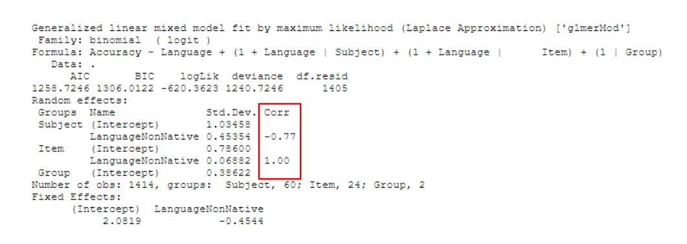
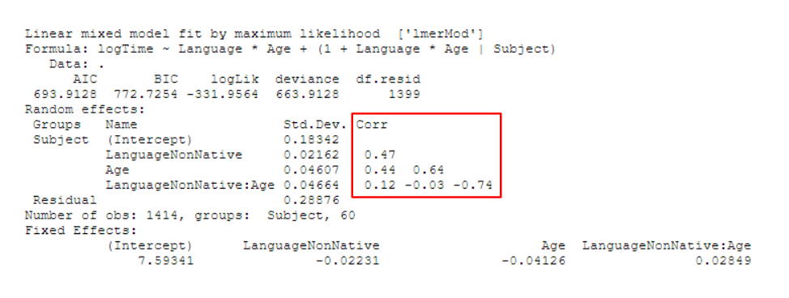
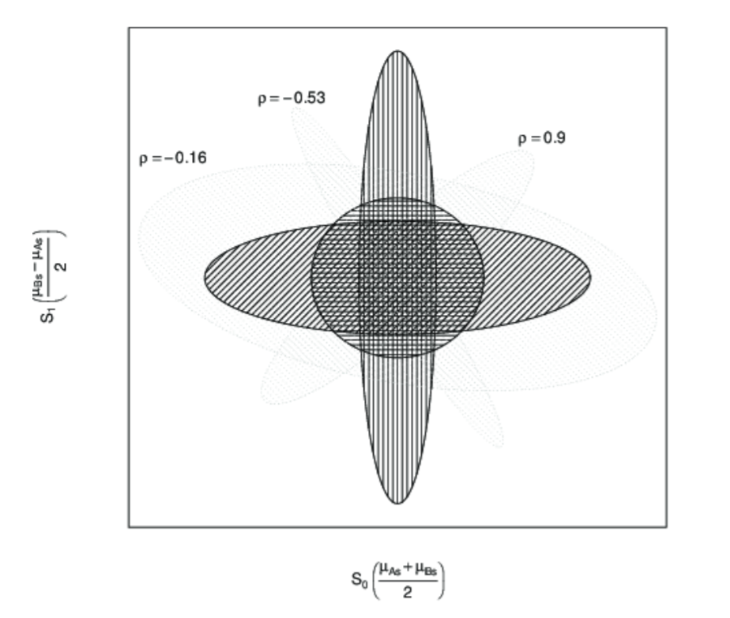

```{r opts}
knitr::opts_chunk$set(
  comment = " ",
  echo = TRUE,
  message = TRUE,
  warning = TRUE,
  R.options = list(width = 80)
)
```

## **What is `Corr` in the output of mixed-effects models?**

When fitting mixed effects regression models, especially those that try to keep it "maximal" (as per [Barr, Levy, Scheepers, & Tily 2013](https://www.ncbi.nlm.nih.gov/pmc/articles/PMC3881361/)), the random effects in the output of the model sometimes displays a column named `Corr` where some rows have numbers that range from `-1` to `1`.



It's easy to guess that `Corr` stands for **correlation** and that the numbers in the column are **correlation coefficients**. If there are multiple predictors and the random effects structure includes more than one of those terms (e.g., `(1 + Effect_1 * Effect_2 | Subject)`), we even get another clue for this from the way that the `Corr` values spread out in the shape of a right triangle, much like in a **correlation matrix**.



Despite the fact that we're bound to have encountered this at some point when working with or reading about mixed effects models, I've found that there aren't many beginner-friendly material explaining what they are - there are one-paragraph StackExchange answers and dense statistics papers, but not much in between in terms of comprehensiveness.

So here are my compiled notes on correlation parameters in linear mixed effects models that I've made for myself (with a basic knowledge of LMEMs).

# **Before we get started**

### **Our toy data and model**

```{r setup, message=FALSE, warning=FALSE, echo=FALSE}
# options for nicer looking numbers
options(digits=2)

# Load packages
library(MASS)
library(lme4)
library(afex)
library(tidyverse)
library(patchwork)
library(performance)
library(broom)
library(DT)
library(sjPlot)

# Set seed for replication
set.seed(1234)
```

For the purposes of this discussion, I have created a toy experiment data (the code used to generate it is attached at the bottom).

The dataset `toydata` has 1,920 rows with the following columns:

-   `Subject`: The subject ID, which ranges from 1 to 80
-   `Item`: The item ID, which ranges from 1 to 24
-   `Condition`: The experimental condition, which is either `Control` or `Treatment`
-   `Response`: A continuous observed variable

```{r make_data, echo=FALSE}
###########
## Setup ##
###########

# Set number of participants and items
n_subjects <- 80
n_items <- 24

# Set levels
Subject <- gl(n_subjects, n_items)
Item <- rep(gl(n_items, 1), n_subjects)
Condition <- factor(rep(c(rep(c("Control", "Treatment"), n_items/2),
                   rep(c("Treatment", "Control"), n_items/2)),
                 n_subjects/2))

# Treatment coding
Condition_coded <- ifelse(Condition == "Control", 0, 1)


# Skeletal structure
Data <- tibble(Subject, Item, Condition, Condition_coded)

#############################
## Add Intercept and Slope ##
#############################

# Add intercept
Data$Intercept <- 200

# Add slope
Data$Slope <- ifelse(Data$Condition == "Treatment", 30, 0)

########################
## Add Random Effects ##
########################

# By-subject variation in intercept and slope (sampled from bivariate normal)
sd_subj_intercept <- 25
sd_subj_slope <- 10
subj_ranef_cor <- 0.8

subj_ranef <- mvrnorm(n_subjects,
                     c("Intercept" = 0, "Slope" = 0), # means of two normals are both 0
                     # covariance matrix
                     matrix(
                       c(sd_subj_intercept^2, subj_ranef_cor * sd_subj_intercept * sd_subj_slope,
                         subj_ranef_cor * sd_subj_intercept * sd_subj_slope, sd_subj_slope^2),
                       ncol = 2)
                     )

Data$Subj_intercept <- rep(subj_ranef[,"Intercept"], each = n_items)
Data$Subj_slope <- rep(subj_ranef[,"Slope"], each = n_items)

# By-item variation in intercept and slope (sampled independently)
Data$Item_intercept <- rep(rnorm(n_items, sd = 5), times = n_subjects)
Data$Item_slope <- rep(rnorm(n_items, sd = 15), times = n_subjects)

###############
## Add Noise ##
###############

Data$Noise <- rnorm(nrow(Data), 0, 5) + rlnorm(nrow(Data), 0.5)

###########################
## Generate observations ##
###########################

Data <- Data %>%
  mutate(Response =
           Intercept +
           Slope * Condition_coded +
           Subj_intercept +
           Subj_slope * Condition_coded +
           Item_intercept +
           Item_slope * Condition_coded +
           Noise)

#######################################
## The data that the researcher sees ##
#######################################

toydata <- Data %>% 
  select(Subject, Item, Condition, Response)
```

```{r}
toydata
```

Imagine `toydata` to be the results from a very simple experiment. In this imaginary experiment, there are 80 subjects and each subject is tested on 24 items, resulting in a total of 1,920 trials/observations. This is a within-partipant design, so each participant sees 12 of the items in the Control condition and the other 12 in the Treatment condition.

Let's say that with our toy data, we want to know **whether Condition has a positive effect on Response**. Our goal by using mixed-effects modeling is to isolate the effect of Condition on Response (fixed effect), while controlling for by-item and by-subject variations (random effects). So let's fit a simple linear mixed-effects model with the maximal random effects structure, with random intercepts and slopes for Condition by Subject and Item:

```{r model}
model <- lmer(Response ~ Condition + (1+Condition|Subject) + (1+Condition|Item),
              REML = FALSE, control = lmerControl('bobyqa'), data = toydata)
```

And let's really quickly check model assumptions:

```{r check_model, error=FALSE, message=FALSE, warning=FALSE, eval=FALSE}
performance::check_model(model)
```

```{r _check_model, echo=FALSE, results=FALSE, message=F, warning=F}
library(performance)
summ <- summary(model)
capture.output(x <- check_model(model))
x
```

Everything looks okay, so let's look at the model output:

```{r model_summary}
summary(model)
```

The high t-statistic and low p-value of `ConditionTreatment` in the fixed effects output suggests that our data is extremely unlikely given the null hypothesis that Condition has no effect on Response (and the sign of the estimate further suggests a positive effect of the Treatment condition on Response compared to the Control condition). Therefore, this is strong evidence in support of our hypothesis.

Here's a nicer-looking summary table made with `tab_model()` from the `{sjPlot}` package. I will keep using this format from this point on. Not only is this nicer to look at, the notations used here (like $\tau_{00}$ and $\rho_{01}$) are from Barr et al. (2013), so it's easier to connect the pieces IMO.

```{r}
sjPlot::tab_model(model)
```

Okay so our finding is great and all but we're more interested in the random effects here so let's look at that.

### **The random effects (a review)**

We can isolate the random effects from the model using `VarCorr()`:

```{r varcor}
VarCorr(model)
```

Let's ignore the `Corr` column for a moment and talk about `Std.Dev` first.

The `Std.Dev.` values for the Subject random effects group suggest that the variation in the subject intercepts are fitted with a larger standard deviation of `r attr(summary(model)$varcor$Subject, 'stddev')[1]` and that the variation in subject slopes for Condition are fitted with a smaller standard deviation of `r attr(summary(model)$varcor$Subject, 'stddev')[2]`.

Let's plot the by-subject variation:

```{r ranef_subj_plot, echo=FALSE}
# Extract intercept and slope estimates
estimates <- summary(model)$coefficients[,1]

# Extract subject intercepts and slopes
ranef_subj <- ranef(model)$Subject

# Plot
ranef_subj %>% 
  as_tibble(rownames = "Subject") %>% 
  rename_at(2:3, ~c("Subj_intercept", "Subj_slope")) %>% 
  mutate(Intercept = estimates[1],
         Slope = estimates[2]) %>% 
  mutate(Control = Intercept + Subj_intercept,
         Treatment = Control + Slope + Subj_slope) %>% 
  gather(Condition, Value, Control:Treatment) %>% 
  ggplot(aes(Condition, Value, group = Subject)) +
  geom_point(color = 'grey60') + geom_line(color = 'grey60') + 
  geom_segment(aes(x = "Control", y = estimates[1], xend = "Treatment", yend = sum(estimates)),
               color = 'red', size = 1) +
  theme_classic() +
  labs(title = "Random Intercepts and Slopes by Subject (aggregate in red)",
       y = "Response")
```

We see a clear variation in the intercepts, and a subtler variation in the slopes. This is overall pretty consistent with the stand deviation values for subject random effects that we found earlier.

Let's plot the by-item variation as well:

```{r ranef_item_plot, echo=FALSE}
# Extract intercept and slope estimates
estimates <- summary(model)$coefficients[,1]

# Extract subject intercepts and slopes
ranef_item <- ranef(model)$Item

# Plot
ranef_item %>% 
  as_tibble(rownames = "Item") %>% 
  rename_at(2:3, ~c("Item_intercept", "Item_slope")) %>% 
  mutate(Intercept = estimates[1],
         Slope = estimates[2]) %>% 
  mutate(Control = Intercept + Item_intercept,
         Treatment = Control + Slope + Item_slope) %>% 
  gather(Condition, Value, Control:Treatment) %>% 
  ggplot(aes(Condition, Value, group = Item)) +
  geom_point(color = 'grey60') + geom_line(color = 'grey60') + 
  geom_segment(aes(x = "Control", y = estimates[1], xend = "Treatment", yend = sum(estimates)),
               color = 'red', size = 1) +
  theme_classic() +
  labs(title = "Random Intercepts and Slopes by Item (aggregate in red)",
       y = "Response")
```

Here, we see the opposite: a clear variation in the slopes, and a subtler variation in the intercepts. Again, this is overall pretty consistent given the item random effects output: a larger standard deviation for the item slopes and a smaller standard deviation for item intercepts, as we found earlier.

Now that we've reviewed `Std.Dev.`, let's talk about `Corr`, which is our main focus.

# **The Correlation Parameter**

Looking at the `Corr` column now, we see two numbers: `r attr(summary(model)$varcor$Subject, 'correlation')[2]` within the Subject random effects group and `r attr(summary(model)$varcor$Item, 'correlation')[2]` within the Item random effects group.

```{r varcor_ex1, echo=FALSE}
VarCorr(model)
```

As you might have guessed, they have something to do with **the correlation between random effects** (intercept and slope) within each group (subject and item).

But if we extract the subject random effects, for example, and measure the correlation between subject intercepts and subject slopes, we get a slightly different number:

```{r check_subj_cor}
# Extract by-subject intercept and slope
ranef_subj <- ranef(model)$Subject

ranef_subj_intercepts <- ranef_subj$`(Intercept)`
ranef_subj_slopes <- ranef_subj$ConditionTreatment

# Calculate correlation
cor(ranef_subj_intercepts, ranef_subj_slopes)
```

In fact, we get slightly different values for the *standard deviation* of the subject random intercepts and slopes as well:

`r options(digits=4)`

```{r check_subj_sd}
# Calculate the standard deviation of by-subject intercepts and slopes
summarize_all(ranef_subj, sd)
```

`r options(digits=2)`

So it looks like what the model isn't just taking the random effects in our `toydata` dataset and calculating their variations and correlations. So then what *is* it doing?

### **How the model estimates random effects**

What we have to keep in mind when doing mixed effects modeling is that the model is **fitting** the random effects in the data, rather than just **describing** them. More specifically, the model is **estimating** *population* parameters that **generated** the *sample* of random effects that are seen in the data.[^1]

[^1]: This distinction is also reflected in the fact that the notation for random effect standard deviation is tau ($\tau$), which is a Greek symbol. In statistics, Greek symbols (like $\beta$, which we may be more familiar with) refers to population-level paramters.

And in fact that's exactly what we want to do. We don't care about how individual subjects or items behave in our experiment, in the sense that we don't care how fast John Doe presses a button, for example. We don't want to predict John Doe's behavior, but we do want to estimate, using data from John Doe, Jane Doe, Average Joe, and other participants from our experiment, the overall distribution of people's idiosyncratic tendencies so that we can statistically control for them to get a better estimate for the fixed effects that we care about.

Take the random intercepts by subject for example. The model estimated the distribution of subject intercepts to follow a normal distribution with a standard deviation of `r attr(summary(model)$varcor$Subject, 'stddev')[1]`, which is a an estimate of the **Population**. The variation in subject intercepts in the data itself that we manually calculated above (`r summarize_all(ranef_subj, sd)[1,1]`) is the **Sample** standard deviation. Of course, if the sample follows a normal distribution and if we also assume the population to be normally distributed, the sample variance should be the best estimate for the population variance. And in fact they do end up being very close!

So the numbers in the `Std.Dev.` colum are the model's **fit** for the **variation** within each random effect.

With this, we now have a better understanding of the numbers in the `Corr` column: they are the model's **fit** for the **correlation** between random effects.

To go more in depth with our discussion, let's plot the intercepts and slopes for our 80 subjects:

```{r corr_plot, echo=FALSE}
ranef_subj_plot <- ranef_subj %>% 
  rename_all(~c("Subject Intercepts", "Subject Slopes")) %>% 
  ggplot(aes(`Subject Intercepts`, `Subject Slopes`)) +
  geom_point() +
  theme_classic() +
  ylim(-40,40) +
  xlim(-80,80)

ranef_subj_plot +
  ggtitle("Subject Random Effects from 'model'")
```

Recall that when we manually calculated the correlation between subject intercepts and subject slopes within our sample of `r length(levels(Subject))` subjects in the data, we got `r cor(ranef_subj_intercepts, ranef_subj_slopes)`. That is in fact what is shown by the plot above.

And as we discussed earlier, the numbers in the `Std.Dev.` column are the model's fit for the variation within each random effect. So the model is saying that the variation for subject intercepts follows a normal distribution with mean = 0 and standard deviation = `r attr(summary(model)$varcor$Subject, 'stddev')[1]`. Likewise, the model is saying that the variation for subject slopes follows a normal distribution with mean = 0 and standard deviation = `r attr(summary(model)$varcor$Subject, 'stddev')[2]`.[^2]

[^2]: But what if the distribution of random effects has a mean that is not equal to zero? Well that just shifts the fixed effects estimate, so the distribution of random effects can be fully characterized by just its variance/standard deviation. This is also why you should never remove a term from fixed effects without removing it from random effects like in `Response ~ 1 + (1 + Condiiton | Subject)` without a good reason, because the model will *assume* the fixed effect of `Condition` to be *zero*.

So the model estimates these two distributions - one for subject slopes and one for subject intercepts - to capture the overall distribution of subject random effects.

This is illustrated below, where the normal curve at the top is the distribution of subject intercepts estimated by the model, and the normal curve to the right is the distribution of subject slopes estimated by the model. For every subject, their intercepts and slopes are understood to be generated from these two underlying parameters:

```{r all_plot, message=FALSE, warning=FALSE, echo=FALSE}
# Subject intercepts distribution
subj_intercept_dist <- function(x) {dnorm(x, sd = attr(summary(model)$varcor$Subject, 'stddev')[1])}

subj_intercepts_plot <- ggplot(tibble(x = c(-80,80)), aes(x)) +
  geom_area(stat = "function", fun = subj_intercept_dist,
            fill = "grey", color = "black") +
  ylim(0, 0.02) + theme_void()

# Subject slopes distribution
subj_slopes_dist <- function(x) {dnorm(x, sd = attr(summary(model)$varcor$Subject, 'stddev')[2])}

subj_slopes_plot <- ggplot(tibble(x = c(-40,40)), aes(x)) +
  geom_area(stat = "function", fun = subj_slopes_dist, fill = "grey", color = "black") +
  ylim(0, 0.04) + theme_void() + coord_flip()

# Plot together
library(patchwork)

subj_intercepts_plot + plot_spacer() + (ranef_subj_plot + geom_point(color = "white")) + subj_slopes_plot + 
  plot_layout(ncol = 2, nrow = 2, widths = c(4, 1), heights = c(1, 4))
```

But is specifying each distribution for intercept and item *enough* to capture the overall distribution of subject random effects?

One way to test this is to work backwards and generate some observations from the model's parameters. The idea here is this: if the two normal distributions (one for subject intercept and one for subject slope) can sufficiently capture the distribution of the subject random effects, then sampling from them should yield a distribution that is in the shape of the actual distribution in our data.

Let's draw 80 samples of subject intercepts and subject slopes from their respective distributions and then plot them together. Here's one result:

```{r sim_plot, echo=FALSE, message=FALSE, warning=FALSE}
# Sample from the two distributions
ranef_subj_sim <- tibble("Subject Intercept" = rnorm(80, sd = attr(summary(model)$varcor$Subject, 'stddev')[1]),
                         "Subject Slope" = rnorm(80, sd = attr(summary(model)$varcor$Subject, 'stddev')[2]))

ranef_subj_sim_plot <- ranef_subj_sim %>% 
  rename_all(~c("Subject Intercepts", "Subject Slopes")) %>% 
  ggplot(aes(`Subject Intercepts`, `Subject Slopes`)) +
  geom_point() +
  theme_classic() +
  ylim(-40,40) +
  xlim(-80,80)

# Plot together
subj_intercepts_plot + plot_spacer() + ranef_subj_sim_plot + subj_slopes_plot + 
  plot_layout(ncol = 2, nrow = 2, widths = c(4, 1), heights = c(1, 4))
```

These points are consistent with what the two distributions predict: there are more points towards the center (the means of the distributions) and less points towards the corners (the tails of the distributions).

But this doesn't look like the *actual distribution* of our subject random effects.

We can repeat this sampling procedure many times, but none of them look close to the distribution of the subject random effects in our data:

<aside>
For clearer comparison, here is the plot of the subject random effects in our data again.

&nbsp;
</aside>

```{r sim_plot_multi, echo=FALSE, message=FALSE, warning=FALSE}
# Sample from the two distributions
ranef_subj_sim_multi <- tibble("Subject Intercept" = rnorm(720, sd = attr(summary(model)$varcor$Subject, 'stddev')[1]),
                         "Subject Slope" = rnorm(720, sd = attr(summary(model)$varcor$Subject, 'stddev')[2]))

ranef_subj_sim_multi$Sample <- rep(1:9, each = 80)

 ranef_subj_sim_multi %>% 
  rename_at(1:2, ~c("Subject Intercepts", "Subject Slopes")) %>% 
  ggplot(aes(`Subject Intercepts`, `Subject Slopes`)) +
  geom_point() +
  ylim(-40,40) +
  xlim(-80,80) +
  facet_wrap(~Sample, ncol = 3, labeller = label_both) +
  theme_classic()
```

<aside>
```{r corr_plot_copy, echo = FALSE}
<<corr_plot>>
```
</aside>


### **So what are we missing here?**

Well, what's missing here is the **correlation** between the intercepts and slopes that I conveniently left out to demonstrate that just specifying the individual distributions for subject intercepts and subject slopes **poorly captures** the actual distribution of subject random effects in our data.

In more technical terms, treating the two random effects as independently sampled from their respective distributions fails to fit the data well because the two random effects are highly correlated. They should instead be treated as being jointly sampled from a bivariate distribution

And that's exactly what adding the **correlation parameter** does. Let's break this down.

When we say that two variables are **independently sampled** from two distributions (as we just did above), then their **joint distribution** looks something like this, where most of the data is expected to fall within the grey shaded ellipse:

```{r parameter_ellipse, message=FALSE, warning=FALSE, echo=FALSE}
library(ggforce)

dist_area <- ranef_subj_sim %>% 
  rename_all(~c("Subject Intercepts", "Subject Slopes")) %>% 
  ggplot(aes(`Subject Intercepts`, `Subject Slopes`)) +
  geom_ellipse(aes(x0=0, y0=0,
                   a = attr(summary(model)$varcor$Subject, 'stddev')[1]*2,
                   b = attr(summary(model)$varcor$Subject, 'stddev')[2]*2,
                   angle = 0,
                   m1 = 2),
               fill = 'lightgrey',
               color = 'lightgrey') +
  ylim(-40, 40) + xlim(-80, 80) +
  theme_classic()

subj_intercepts_plot + plot_spacer() + dist_area + subj_slopes_plot + 
  plot_layout(ncol = 2, nrow = 2, widths = c(4, 1), heights = c(1, 4))
```

This is clearly a bad fit for the distribution of our subject random effects...

```{r bad_fit, echo=FALSE}
subj_intercepts_plot + plot_spacer() + (ranef_subj_plot +  geom_ellipse(aes(x0=0, y0=0,
                   a = attr(summary(model)$varcor$Subject, 'stddev')[1]*2,
                   b = attr(summary(model)$varcor$Subject, 'stddev')[2]*2,
                   angle = 0,
                   m1 = 2),
               fill = 'lightgrey',
               color = 'lightgrey') + geom_point()) + subj_slopes_plot + 
  plot_layout(ncol = 2, nrow = 2, widths = c(4, 1), heights = c(1, 4))
```

... because the distribution of the subject random effects actually takes the shape of a *tilted* ellipse instead (dotted outline):

```{r data_ellipse, echo=FALSE, message=FALSE, warning=FALSE, preview = TRUE}
subj_intercepts_plot + plot_spacer() + (ranef_subj_plot +  geom_ellipse(aes(x0=0, y0=0,
                   a = attr(summary(model)$varcor$Subject, 'stddev')[1]*2,
                   b = attr(summary(model)$varcor$Subject, 'stddev')[2]*2,
                   angle = 0,
                   m1 = 2),
               fill = 'lightgrey', color = 'lightgrey') + 
                   stat_ellipse(geom = 'polygon', fill = NA, color = 'black', show.legend = FALSE, linetype = 2) +
                 geom_point()) + subj_slopes_plot + 
  plot_layout(ncol = 2, nrow = 2, widths = c(4, 1), heights = c(1, 4))
```

In fact, we cannot generate any distribution of a tilted shape with just two independent distributions for each variable. We need to factor in **covariation** to capture the correlation between variables. Barr et al. (2013) illustrates this clearly in [the supplementary materials to their paper](http://talklab.psy.gla.ac.uk/simgen/rsonly.html). You can see from the plot below (originally Figure 1 on the linked page) that without the correlation parameter, you can only capture distributions that are symmetrical with respect to the axes (the darker ellipses). However, once you add in a correlation parameter ($\rho$), you can capture distributions that are in the "tilted" shape (the lighter ellipses) like the distribution of our highly correlated subject intercepts and subject slopes.

```{r fig.cap="Figure from Barr et al. (2013)", echo = FALSE, out.extra="class=external", fig.align='center'}

```

### **Putting it all together**

Here's the output of `model` again:

```{r, echo=F}
tab_model(model)
```

And let's keep focusing on the subject random effects for now.

There are three parameters that the model estimated to capture the *by-subject* variation:

1.  The variation (`Std.Dev.`) for subject intercept

2.  The variation (`Std.Dev.`) for subject slope

3.  The correlation (`Corr`) between subject intercept and subject slope.

With these three parameters, the model is defining a **bivariate normal distribution**, from which subject intercepts ($S_{0s}$) and subject slopes ($S_{1s}$) are sampled from (Equation 3 from Barr et al., 2013):

$$(S_{0s}, S_{1s})\ \sim\ N(0,\begin{bmatrix}\tau_{00}^2 & \rho\ \tau_{00}^2 \tau_{11}^2 \\ \rho\ \tau_{00}^2 \tau_{11}^2 & \tau_{11}^2 \end{bmatrix})$$

For the **variance-covariance matrix**, we can substitute the standard deviation for the subject intercept $\tau_{00}^2$ with `r attr(summary(model)$varcor$Subject, 'stddev')[1]`, the standard deviation for the subject slope $\tau_{11}$ with `r attr(summary(model)$varcor$Subject, 'stddev')[2]`, and the correlation $\rho$ with `r attr(summary(model)$varcor$Subject, 'correlation')[2]` to get the following:

$$(S_{0s}, S_{1s})\ \sim\ N(0,\begin{bmatrix}`r attr(summary(model)$varcor$Subject, 'stddev')[1]`^2 & `r attr(summary(model)$varcor$Subject, 'correlation')[2]`\ \times\ `r attr(summary(model)$varcor$Subject, 'stddev')[1]`\ \times\ `r attr(summary(model)$varcor$Subject, 'stddev')[2]` \\ `r attr(summary(model)$varcor$Subject, 'correlation')[2]`\  \times\ `r attr(summary(model)$varcor$Subject, 'stddev')[1]`\ \times\ `r attr(summary(model)$varcor$Subject, 'stddev')[2]` & `r attr(summary(model)$varcor$Subject, 'stddev')[2]`^2 \end{bmatrix})$$

If subject intercepts and subject slopes are jointly sampled from the above distribution, most observations should fall within this grey area:


```{r bivariate_dist, echo=FALSE, warning=FALSE}
mv_sim <- mvrnorm(n = 720, mu = c("Subject Intercepts" = 0, "Subject Slopes" = 0),
                  Sigma = matrix(c(attr(summary(model)$varcor$Subject, 'stddev')[1]^2,
                                   prod(attr(summary(model)$varcor$Subject, 'stddev')) *
                                     attr(summary(model)$varcor$Subject, 'correlation')[2],
                                   prod(attr(summary(model)$varcor$Subject, 'stddev')) *
                                     attr(summary(model)$varcor$Subject, 'correlation')[2],
                                   attr(summary(model)$varcor$Subject, 'stddev')[2]^2),
                                 ncol=2))
mv_sim <- as_tibble(mv_sim) %>% 
  mutate(Sample = rep(1:9, each = 80))

corr <- mv_sim %>% 
  ggplot() +
  ggtitle(bquote(rho ~ "=" ~ .(attr(summary(model)$varcor$Subject, 'correlation')[2]))) +
  theme_classic() +
  theme(plot.title = element_text(hjust = 0.5, vjust = -13, size = 15, face = "bold"),
        axis.line.x = element_blank(), axis.line.y = element_blank())

subj_intercepts_plot + corr + (mv_sim %>% ggplot(aes(`Subject Intercepts`, `Subject Slopes`)) + stat_ellipse(geom = 'polygon', fill = 'lightgrey') + theme_classic() + xlim(-60,60) + ylim(-30,30)) + subj_slopes_plot + 
  plot_layout(ncol = 2, nrow = 2, widths = c(4, 1), heights = c(1, 4))
```

<aside>
Notice how I added  $\rho = 0.85$ in this top right corner of this plot.
</aside>

Let's again repeatedly sample from this new bivariate distribution (which you can do with `mvrnorm()` from the `{MASS}` package) to check:

```{r wrapup, echo = FALSE, warning=FALSE}
mv_sim %>% 
  ggplot(aes(`Subject Intercepts`, `Subject Slopes`)) +
  geom_point() +
  ylim(-40,40) +
  xlim(-80,80) +
  theme_classic() +
  facet_wrap(~Sample, ncol = 3, labeller = label_both)

```

Like we expected, this new distribution generates observations of subject slopes and subject intercepts that are highly correlated. But more importantly, the distribution of subject random effects in our data looks like it could be one of these samples, meaning that this bivariate normal distribution **fits our data well**.

Good thing that we had the model estimate this parameter by specifying the random effects structure for subjects as `(1 + Condition | Subject)` in our model formula!

### **What if we leave out this correlation parameter? Would it significantly worsen model fit?**

We can check by building another model without the correlation term between the subject random effects and comparing it with our original model.[^3]

[^3]: Removing a correlation term in `lmer()` turns out to be actually sort of tricky if you don't explicitly numerically code your factors - sometimes just using the double bar syntax (`||`) doesn't always work. I won't go into the details of how to do that here, but there are good discussions of doing this using `model.matrix()` in [this Rpubs post](https://rpubs.com/Reinhold/22193) and Section 5.4 (also Appendix E) of [Frossard and Renaud (2019)](https://arxiv.org/pdf/1903.10766.pdf). I could have done numeric coding with something like `mutate(data, Condition = as.integer(Condition == "Treatment"))`, but I wanted to try this way out for myself

The `no_subj_cor_model` below is a *depleted* model without the correlation parameter between the random intercepts and random slopes by subject. You can see that the subject group is missing a value in the `Corr` column.[^4]

[^4]: Here, $\tau_{00\ Subject.1}$ is actually the same as the $\tau_{00\ Subject.ConditionTreatment}$ term from the maximal model, `model`. I don't know how to suppress this name change after dropping a correlation term - if you do, please let me know!

```{r no_subj_cor_model}
no_subj_cor_model <- lmer(Response ~ Condition + (1+model.matrix(model)[,2]||Subject) + (1+Condition|Item),
                          REML = FALSE, control = lmerControl('bobyqa'), data = toydata)

tab_model(no_subj_cor_model)
```

Now let's perform a likelihood ratio test using `anova()`:

```{r}
anova(no_subj_cor_model, model, test = 'Chisq')
```

The first thing to notice is that `no_subj_cor_model` has one less `Df`, or **degrees of freedom**, than `model`. This is because every correlation between random effects is an *additional parameter* that the model is estimating. So removing the correlation between random effects for `no_subj_cor_model` leaves it with 8 parameters, one less than the original, full model. There's a good discussion of what parameters are specified by different `lmer()` formulas in [this StackExchange thread](https://stats.stackexchange.com/a/13173).

After performing this sanity check, the next thing to note is the very low number in `Pr(>Chisq)`, telling us that the models are significantly different from one another. This might come off as weird if you're only used to performing ANOVA comparisons to check whether a predictor is significant or not. In fact, there are no obvious differences between the output of `no_subj_cor_model` and the output of our original model other than the presence/absence of the correlation between subject random effects.

But clearly something major is going on behind the curtains, so we turn to the last term(s) of interest - `AIC` and `BIC`, which are scores for model fit. The numbers are hard to interpret on their own, but useful when comparing models. Here, both the `AIC` and the `BIC` of `no_subj_cor_model` are higher than `model`, suggesting that `no_subj_cor_model` has a *worse fit*, and a statistically significant one at that.

More specifically, we know that the only meaningful difference between `no_subj_cor_model` and `model` is the correlation parameter for the subject random effects, so `no_subj_cor_model` must be capturing the subject random effects relativelty poorly under its assumption that subject intercepts and subject slopes do not correlate with one another (i.e., that they are independent).

So let's look at the random effects calculated by `no_subj_cor_model` and its poor attempt at fitting their distribution.

First, let's plot the subject intercepts by subject slopes like we did for our original model:

```{r no_subj_corr_plot, echo=FALSE}
ranef_no_subj_cor_plot <- ranef(no_subj_cor_model)$Subject %>% 
  rename_all(~c("Subject Intercepts", "Subject Slopes")) %>% 
  ggplot(aes(`Subject Intercepts`, `Subject Slopes`)) +
  geom_point() +
  theme_classic() +
  xlim(-80,80) + ylim(-40,40)

ranef_no_subj_cor_plot +
  ggtitle("Subject Random Effects from 'no_subj_cor_model'")
```

You might notice that the `no_subj_cor_model` calculates subject random effects that are very similar to those calculated by our original mode. Here's a side-by-side comparison of the subject random effects from `model` and `no_subj_cor_model`:

```{r echo=FALSE}
(ranef_subj_plot + ggtitle("Subject Random Effects from 'model'")) / (ranef_no_subj_cor_plot + ggtitle("Subject Random Effects from 'no_subj_cor_model'"))
```

This illustrates a very important point. *Removing the correlation parameter does not change the calculation of the random effects* (barring any serious convergence failures, of course). This shouldn't be surprising because random effects, like fixed effects, speak to *facts* (in the frequentist sense) about how the data that we observe is generated. It is literally the case here since I included these random effects explicitly in making `toydata`. But more importantly, the idea that there are random variations generated from underlying population-level parameters is an **assumption** that we are making when we use mixed-effects models.

The only meaningful difference between the two models here, then, is in their **fit** - e.g., how well the model captures the distribution of the subject random effects. We actually went over this above - we saw that our original model fits subject random effects using **a bivariate normal distribution** assuming a correlation, while `no_subj_cor_model` should be fitting subject random effects using **two univariate normal distributions**, assuming no (i.e., *zero*) correlation.

Here's a visual comparison of model fit, with the plot for `model` at the top and the plot for `no_subj_cor_model` at the bottom:

```{r echo=FALSE, warning=FALSE}
no_cor <- ggplot() +
  ggtitle(bquote(rho ~ "= 0")) +
  theme_classic() +
  theme(plot.title = element_text(hjust = 0.5, vjust = -8, size = 15, face = "bold"),
        axis.line.x = element_blank(), axis.line.y = element_blank())

top <- (subj_intercepts_plot + (corr + theme(plot.title = element_text(vjust = -8))) + (mv_sim %>% ggplot(aes(`Subject Intercepts`, `Subject Slopes`)) + stat_ellipse(geom = 'polygon', fill = 'lightgrey') + theme_classic() + geom_point(data = ranef_subj %>% 
                                                                                                                                                                                                                          rename_all(~c("Subject Intercepts", "Subject Slopes"))) +
  xlim(-80,80) + ylim(-40,40)) + subj_slopes_plot + 
          plot_layout(ncol = 2, nrow = 2, widths = c(4, 1), heights = c(1, 4)))

bot <- (subj_intercepts_plot + no_cor + (ranef_no_subj_cor_plot + geom_ellipse(aes(x0=0, y0=0,
                                                                                          a = attr(summary(no_subj_cor_model)$varcor$Subject, 'stddev')[1]*2,
                                                                                          b = attr(summary(no_subj_cor_model)$varcor$Subject.1, 'stddev')[1]*2,
                                                                                          angle = 0,
                                                                                          m1 = 2),
                                                                                      fill = 'lightgrey',
                                                                                      color = 'lightgrey') + geom_point()) + subj_slopes_plot + 
          plot_layout(ncol = 2, nrow = 2, widths = c(4, 1), heights = c(1, 4)))
```

```{r echo=FALSE, warning=FALSE}
top + plot_annotation("Subject random effects and model fit for 'model'")
```

```{r echo=FALSE, warning=FALSE}
bot + plot_annotation("Subject random effects and model fit for 'no_subj_cor_model'")
```

Where the term $\rho = 0$ in the plot for `no_subj_cor_model` indicates that the subject intercepts and subject slopes are generated from this bivariate distribution:

$$(S_{0s}, S_{1s})\ \sim\ N(0,\begin{bmatrix} \tau_{00}^2 & 0 \\ 0 & \tau_{11}^2 \end{bmatrix})$$

Which is the same as independetly sampling from these two univariate normal distributions:

$$S_{0s} \sim N(0, \tau_{00})$$

$$S_{1s} \sim N(0, \tau_{11})$$

Now, looking at the previous pair of plots, `no_subj_cor_model` (bottom) clearly fits the distribution of the subject random effects poorly compared to our original model `model` (top), and that appears to be the driving the significant decrease in fit that we found from the likelihood ratio test earlier. It seems to be the case that the inclusion of the correlation parameter between subject random intercepts is necessary to fit the data well.

### **Are correlation parameters always necessary?**

The question of how "maximal" our models should be is very tricky, and especially so when it concerns the inclusion/exclusion of correlation parameters (see discussions [here](https://vasishth-statistics.blogspot.com/2014/08/an-adverse-consequence-of-fitting.html) and [here](https://vasishth-statistics.blogspot.com/2014/11/should-we-fit-maximal-linear-mixed.html)). For example, [Bates, Kliegl, Vasishth, & Baayen (2015)](https://arxiv.org/pdf/1506.04967.pdf) and [Matuschek, Kliegl, Vasishth, & Baayen (2017)](https://doi.org/10.1016/j.jml.2017.01.001) have called for **parsimonious models** with stricter criteria for including terms in the model, beyond whether they cause the model to fail to converge.[^5]

[^5]: The (simplified) argument here is that having the model estimate superfluous variance components can make it more difficult for the model to detect an effect if it actually exists - i.e., can lead to a loss of power

I'll demonstrate one case here where it doesn't seem like including a correlation parameter particularly improves model fit.

Let's repeat the model comparison process above, except this time taking out the correlation parameter for *item*.

For context, here is the random effects output of `model` again:

```{r echo=FALSE}
summary(model)$varcor
```

Again, there are three parameters that the model estimated to capture the *by-item* variation:

1.  The variation (`Std.Dev.`) for item intercept

2.  The variation (`Std.Dev.`) for item slope

3.  The correlation (`Corr`) between item intercept and item slope.

And here is what the distribution of item random effects from `model` look like:

```{r item_corr_plot, echo=FALSE}
ranef_item_plot <- ranef_item %>% 
  rename_all(~c("Item Intercepts", "Item Slopes")) %>% 
  ggplot(aes(`Item Intercepts`, `Item Slopes`)) +
  geom_point() +
  theme_classic() +
  ylim(-50,50) + xlim(-25,25)

ranef_item_plot +
  ggtitle("Item Random Effects from 'model'")
```

Our model fitted a bivariate normal distribution with the standard deviation of item intercepts = `r attr(summary(model)$varcor$Item, 'stddev')[1]`, the standard deviation of item slopes = `r attr(summary(model)$varcor$Subject, 'stddev')[2]`, and correlation = `r attr(summary(model)$varcor$Item, 'correlation')[2]`.

We can again visualize the fit of `model` to the distribution of the item random effects:

```{r echo=FALSE, warning=FALSE}
# Item intercepts distribution
item_intercept_dist <- function(x) {dnorm(x, sd = attr(summary(model)$varcor$Item, 'stddev')[1])}

item_intercepts_plot <- ggplot(tibble(x = c(-25,25)), aes(x)) +
  geom_area(stat = "function", fun = item_intercept_dist,
            fill = "grey", color = "black") +
  ylim(0, 0.08) +
  theme_void()


# Item slopes distribution
item_slopes_dist <- function(x) {dnorm(x, sd = attr(summary(model)$varcor$Item, 'stddev')[2])}

item_slopes_plot <- ggplot(tibble(x = c(-50,50)), aes(x)) +
  geom_area(stat = "function", fun = item_slopes_dist, fill = "grey", color = "black") +
  ylim(0, 0.04) +
  theme_void() +
  coord_flip()

# sim
mv_item_sim <- mvrnorm(n = 720, mu = c("Item Intercepts" = 0, "Item Slopes" = 0),
                  Sigma = matrix(c(attr(summary(model)$varcor$Item, 'stddev')[1]^2,
                                   prod(attr(summary(model)$varcor$Item, 'stddev')) *
                                     attr(summary(model)$varcor$Item, 'correlation')[2],
                                   prod(attr(summary(model)$varcor$Item, 'stddev')) *
                                     attr(summary(model)$varcor$Item, 'correlation')[2],
                                   attr(summary(model)$varcor$Item, 'stddev')[2]^2),
                                 ncol=2))
mv_item_sim <- as_tibble(mv_item_sim) %>% 
  mutate(Sample = rep(1:9, each = 80))

# cor
corr <- mv_item_sim %>% 
  ggplot() +
  ggtitle(bquote(rho ~ "=" ~ .(attr(summary(model)$varcor$Item, 'correlation')[2]))) +
  theme_classic() +
  theme(plot.title = element_text(hjust = 0.5, vjust = -13, size = 15, face = "bold"),
        axis.line.x = element_blank(), axis.line.y = element_blank())

# plot
item_intercepts_plot + corr + (mv_item_sim %>% ggplot(aes(`Item Intercepts`, `Item Slopes`)) + stat_ellipse(geom = 'polygon', fill = 'lightgrey') + theme_classic() + xlim(-25,25) + ylim(-50,50) + geom_point(data = ranef_item %>% 
  rename_all(~c("Item Intercepts", "Item Slopes")))) + item_slopes_plot + 
  plot_layout(ncol = 2, nrow = 2, widths = c(4, 1), heights = c(1, 4)) + plot_annotation("Item random effects and model fit for 'model'")
```

The model estimates a low correlation of `r attr(summary(model)$varcor$Item, 'correlation')[2]`, which is reflected in the small tilt of the ellipse. It looks like the model is capturing the distribution of the item random effects pretty well. But is the correlation parameter really *that* necessary here?

Let's make another depleted model, `no_item_cor_model`, with the correlation between item random effects removed:

```{r no_item_cor_model}
no_item_cor_model <- lmer(Response ~ Condition + (1+Condition|Subject) + (1+model.matrix(model)[,2]||Item),
                          REML = FALSE, control = lmerControl('bobyqa'), data = toydata)

tab_model(no_item_cor_model)
```

Again, the output of the depleted model printed here does not differ that much from the output of `model`. We can see also get a sense of this by visualizing the fit of `no_item_cor_model` to the distribution of item random effects:

```{r echo=FALSE}
item_intercepts_plot + no_cor + (ranef_item_plot +  geom_ellipse(aes(x0=0, y0=0,
                   a = attr(summary(model)$varcor$Item, 'stddev')[1]*2,
                   b = attr(summary(model)$varcor$Item, 'stddev')[2]*2,
                   angle = 0,
                   m1 = 2),
               fill = 'lightgrey',
               color = 'lightgrey') + geom_point()) + item_slopes_plot + 
  plot_layout(ncol = 2, nrow = 2, widths = c(4, 1), heights = c(1, 4)) + plot_annotation("Item random effects and model fit for 'no_item_cor_model'")
```

We can see this more clearly with a side-by-side comparison of model fit by `model` (blue) and `no_item_cor_model` (red):

```{r, warning=FALSE, echo=FALSE}
mv_item_sim %>%
  mutate(Color = rep(c("no_item_cor_model", "model"), each = 360)) %>% 
  ggplot(aes(`Item Intercepts`, `Item Slopes`, color = Color)) +
  geom_line() +
  geom_line(color = 'white', size = 50) +
  theme_classic() +
  xlim(-25,25) +
  ylim(-50,50) +
  geom_ellipse(aes(x0=0, y0=0,
                   a = attr(summary(model)$varcor$Item, 'stddev')[1]*2,
                   b = attr(summary(model)$varcor$Item, 'stddev')[2]*2,
                   angle = 0,
                   m1 = 2),
               fill = 'white',
               color = 'red',
               linetype = 2) +
  stat_ellipse(geom = 'polygon', color = 'blue', fill = NA, alpha = 0.5, linetype = 2) +
  scale_color_manual(values = c("blue", "red")) +
  labs(color = "Model Fit") +
  theme(legend.position = c(0.15,0.9))
```

Doesn't seem like there are big differences here, but we have to run some statistics to be sure. So let's perform another log likelihood ratio test:

```{r}
anova(no_item_cor_model, model)
```

```{r, echo=FALSE, results=FALSE}
item_cor_chisq <- anova(no_item_cor_model, model)$`Pr(>Chisq)`[2]
```

First, for sanity check, we see that `no_item_cor_model` has one less `Df` than `model`, which is what we'd expect if `no_item_cor_model` indeed lacks the correlation parameter for item random effects. Next, we see that the value of `Pr(>Chisq)` is very high, at `r item_cor_chisq`, suggesting that the models are not significantly different. This is corroborated by the very small differences between the models' `AIC` and `BIC` values. These small differences here are likely reducible to the fact that `AIC` and `BIC` penalize more number of parameters (as a way of balancing model fit with model complexity). In fact, the differences in `AIC` between the models is approximately 2, which is exactly what you'd expect [if you added a redundant parameter with no additional explanatory power to the model](https://stats.stackexchange.com/a/121684).

In sum, we see that when modeling our dataset `toydata`, estimating a correlation parameter for subject random effects improves model fit, while doing so for item random effects doesn't as much.

### **Conclusion and implications for model building**

My main goal here was to simply go over what the correlation parameter in mixed-effects models is, so the question of whether we should be including certain correlation parameter(s) in our models are beyond the scope of this discussion (and should be handled on a case-by-case basis). It's also something that I'm in the process of learning, so I don't have a good answer to it yet. But my personal view (which may change later with more knowledge and experience) is to keep correlation parameters in the model *unless they make the model fail to converge*. So in the case of the correlation parameter for item random effects in `model` that we discussed above, I'd personally keep that in since we didn't run into any convergence issues fitting the maximal model. In general, if there's no meaningful difference either way, I err towards leaving the correlation parameter in there. In other words, I try to **keep the model as maximal as possible without overparameterizing it** (Barr et al., 2013).

I don't think that the spirit of this message is really controversial, and the more challenging part of this is putting it into practice. We not only need to balance model fit with model complexity, but we also often need to navigate conflicts between important considerations from statistical theory and from whatever domain our research is in (linguistics, psychology, etc.).

To resolve this, a lot of people have streamlined different methods of reducing the complexity of the random effects structure in a statistically motivated way. One such example is using **Principal Components Analysis** (PCA) (suggested in Bates et al., 2015). In Section 3 of their paper, Bates and colleagues outline a procedure for **iterative model reduction** which involves PCA (now available as `rePCA()` in the `lme4` package) to determine how many random effect terms are sufficient to capture the variance in the random effects. This is still [not a perfect solution](https://rpubs.com/danmirman/repsychling_test1), of course, but it's a good next step for putting this knowledge into practice. ~~Or you can just do *fancy* Bayesian analyses and avoid all these problems, so I hear~~

Anyways, that's it for my notes. Here's the code that generated `toydata`:

```{r eval=FALSE, result=FALSE}
###########
## Setup ##
###########

# Load Packages (make sure dplyr::filter() isn't makes by MASS:filter())
library(MASS)
library(tidyverse)
library(lme4)

# Set seed
set.seed(1234)

# Set number of participants and items
n_subjects <- 80
n_items <- 24

#################
## Make trials ##
#################

# Generate levels
Subject <- gl(n_subjects, n_items)
Item <- rep(gl(n_items, 1), n_subjects)
Condition <- factor(rep(c(rep(c("Control", "Treatment"), n_items/2),
                   rep(c("Treatment", "Control"), n_items/2)),
                 n_subjects/2))

# Treatment coding
Condition_coded <- ifelse(Condition == "Control", 0, 1)

# Combine into trials
Data <- tibble(Subject, Item, Condition, Condition_coded)

#############################
## Add Intercept and Slope ##
#############################

# Add intercept
Data$Intercept <- 200

# Add slope
Data$Slope <- ifelse(Data$Condition == "Treatment", 30, 0)

########################
## Add Random Effects ##
########################

# By-subject variation in intercept and slope (sampled from bivariate normal)
sd_subj_intercept <- 25
sd_subj_slope <- 10
subj_ranef_cor <- 0.8

subj_ranef <- mvrnorm(n_subjects,
                      # means of two normals are both 0
                      c("Intercept" = 0, "Slope" = 0),
                      # 2x2 variance-covariance matrix
                      matrix(
                        c(sd_subj_intercept^2,
                          subj_ranef_cor*sd_subj_intercept*sd_subj_slope,
                          subj_ranef_cor*sd_subj_intercept*sd_subj_slope,
                          sd_subj_slope^2),
                        ncol = 2)
                      )

Data$Subj_intercept <- rep(subj_ranef[,"Intercept"], each = n_items)
Data$Subj_slope <- rep(subj_ranef[,"Slope"], each = n_items)

# By-item variation in intercept and slope (sampled independently)
Data$Item_intercept <- rep(rnorm(n_items, sd = 5), times = n_subjects)
Data$Item_slope <- rep(rnorm(n_items, sd = 15), times = n_subjects)

# Random noise
Data$Noise <- rnorm(nrow(Data), 0, 5) + rlnorm(nrow(Data), 0.5)

###########################
## Generate Observations ##
###########################

Data <- Data %>%
  mutate(Response =
           Intercept +
           Slope * Condition_coded +
           Subj_intercept +
           Subj_slope * Condition_coded +
           Item_intercept +
           Item_slope * Condition_coded +
           Noise)

#################
## Toy Dataset ##
#################

toydata <- Data %>% 
  select(Subject, Item, Condition, Response)
```
