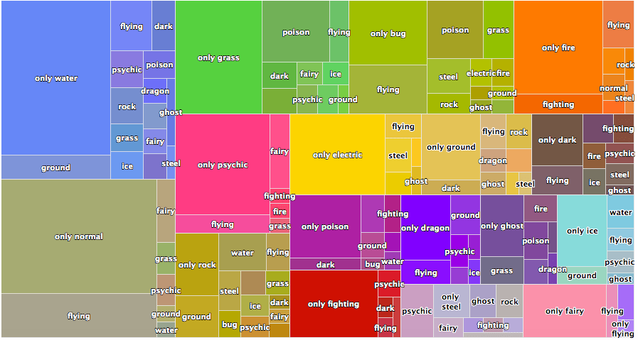

```{r opts}
knitr::opts_chunk$set(
  comment = " ",
  echo = TRUE,
  message = TRUE,
  warning = TRUE,
  R.options = list(width = 80)
)
```

To steal the definition from [Wikipedia](https://en.wikipedia.org/wiki/Treemapping), a treemap is used for "displaying hierarchical data using nested figures, usually rectangles." There are lots of ways to make one in R, but I didn't find any one existing solution appealing.

For illustration, let's take the `pokemon` dataset from `{highcharter}` and plot a treemap with it using different methods.


```{r, echo=FALSE, message=FALSE}
library(tidyverse)
library(printr)
```

```{r}
data("pokemon", package = "highcharter")

# Cleaning up data for a treemap
data <- pokemon %>% 
  select(pokemon, type_1, type_2, color_f) %>%
  mutate(type_2 = ifelse(is.na(type_2), paste("only", type_1), type_2)) %>% 
  group_by(type_1, type_2, color_f) %>% 
  count(type_1, type_2) %>% 
  ungroup()

head(data, 5)
```

&nbsp;

## **1. `{treemap}`**

Here's a plot made from the `{treemap}` package:

```{r}
library(treemap)

treemap(dtf = data,
        index = c("type_1", "type_2"),
        vSize = "n",
        vColor = "type_1")
```

It actually doesn't look too bad, but this package hasn't been updated for 3 years and there aren't a lot of options for customization. For the options that do exist, they're a big list of additional arguments to the main workhorse function, `treemap()`, which feels a bit restrictive if you're used to `{ggplot}`'s modular and layered grammar. So while it's very simple to use, I'd probably use it only for exploring the data for myself.

&nbsp;

## **2. `{highcharter}`**

All the way on the other side of this ease<--->customizability spectrum is `{highcharter}` which is arguably the most powerful data visualization package in R. 

With highcharter, you can turn the previous graph into the following:



This looks much better, and it's even interactive (although this particular one isn't because I just copy pasted the image from [this blog post from 2018](https://www.datacamp.com/community/tutorials/data-visualization-highcharter-r)). I'd use `{highcharter}` except that there isn't a great documentation on plotting treemaps, and it definitely doesn't help that `{highcharter}` has a pretty steep learning curve, even if you have a lot of experience with `{ggplot2}`. 

The main problem I ran into is that the function `hc_add_series_treemap()` that was used to create the above graph is now depreciated. It redirects you to use `hctreemap()` which itself is _also_ depreciated. That finally redirects you to use `hctreemap2()` which is pretty sparse in documentation and use-cases, and overall not very transparent IMO.

&nbsp;

## **3. `{treemapify}`**

`{treemapify}` is a ggplot solution to plotting treemaps.

Here's a plot of the `pokemon` dataset, adopting the example code from the [vignette](https://cran.r-project.org/web/packages/treemapify/vignettes/introduction-to-treemapify.html). Since it follows the layered grammar of ggplot, I figured I'd show what each of the four layers outlined in the code does:

```{r, eval = FALSE}
library(treemapify)

ggplot(data, aes(area = n, fill = color_f, label = type_2,
                subgroup = type_1)) +
  # 1. Draw type_2 borders and fill colors
  geom_treemap() +
  # 2. Draw type_1 borders
  geom_treemap_subgroup_border() +
  # 3. Print type_1 text
  geom_treemap_subgroup_text(place = "centre", grow = T, alpha = 0.5, colour = "black",
                             fontface = "italic", min.size = 0) +
  # 4. Print type_2 text
  geom_treemap_text(colour = "white", place = "topleft", reflow = T) +
  theme(legend.position = 0)
```

**`geom_treemap()` draws type_2 borders and fill colors**

```{r, echo = FALSE}
library(treemapify)

ggplot(data, aes(area = n, fill = color_f, label = type_2,
                subgroup = type_1)) +
  geom_treemap() +
  theme(legend.position = 0)
```

**`geom_treemap_subgroup_border()` draws type_1 borders**

```{r, echo = FALSE}
ggplot(data, aes(area = n, fill = color_f, label = type_2,
                subgroup = type_1)) +
  geom_treemap() +
  geom_treemap_subgroup_border() +
  theme(legend.position = 0)
```

**`geom_treemap_subgroup_text()` prints type_1 text**

```{r, echo = FALSE}
ggplot(data, aes(area = n, fill = color_f, label = type_2,
                subgroup = type_1)) +
  # 1. Draw type_2 borders and fill colors
  geom_treemap() +
  # 2. Draw type_1 borders
  geom_treemap_subgroup_border() +
  # 3. Print type_1 text
  geom_treemap_subgroup_text(place = "centre", grow = T,
                             alpha = 0.5, colour = "black",
                             fontface = "italic", min.size = 0) +
  theme(legend.position = 0)
```

**`geom_treemap_text()` prints type_2 text**

```{r, echo = FALSE}
ggplot(data, aes(area = n, fill = color_f, label = type_2,
                subgroup = type_1)) +
  # 1. Draw type_2 borders and fill colors
  geom_treemap() +
  # 2. Draw type_1 borders
  geom_treemap_subgroup_border() +
  # 3. Print type_1 text
  geom_treemap_subgroup_text(place = "centre", grow = T, alpha = 0.5, colour = "black",
                             fontface = "italic", min.size = 0) +
  # 4. Print type_2 text
  geom_treemap_text(colour = "white", place = "topleft", reflow = T) +
  theme(legend.position = 0)
```

I find this the most appealing out of the three options and I do recommend this package, but I'm personally a bit hesistant to use it for three reasons:

1. I don't want to learn a whole 'nother family of `geom_*`s just to plot treemaps.

2. Some of the ggplot "add-ons" that I like don't really transfer over. For example, I can't use `geom_text_repel()` from `{ggrepel}` because I have to use `{treemapify}`'s own text geoms like `geom_treemap_subgroup_text()` and `geom_treemap_text()`.

3. Customization options are [kind of a mouthful](https://www.rdocumentation.org/packages/treemapify/versions/2.5.3/topics/geom_treemap_text), and I've yet to see a nice-looking treemap that was plotted using this package. There are a couple example treemaps in the [vignette](https://cran.r-project.org/web/packages/treemapify/vignettes/introduction-to-treemapify.html) but none of them look particularly good. An independently produced example [here](http://r-statistics.co/Top50-Ggplot2-Visualizations-MasterList-R-Code.html#Treemap) doesn't look super great either.


&nbsp;


## **A Mixed (Hack-ish?) Solution**

Basically, I'm very lazy and I want to avoid learning any new packages or functions as much as possible.

I've come up with a very simple solution to my self-created problem, which is to draw treemaps using `geom_rect()` with a little help from the `{treemap}` package introduced earlier.

So apparently, there's a cool feature in `treemap::treemap()` where you can extract the plotting data.

You can do this by pulling the `tm` object from the plot function side-effect, and the underlying dataframe used for plotting looks like this.^[You might get a warning referencing something about `data.table` here. No worries if this happens. The outdated `{treemap}` source code is built on `{data.table}` and contains a deprecated argument.]:

```{r, fig.show="hide", warning = FALSE, layout="l-body-outset"}
tm <- treemap(
  dtf = data,
  index = c("type_1", "type_2"),
  vSize = "n",
  vColor = "color_f",
  type = 'color' # {treemap}'s equivalent of scale_fill_identity()
)

head(tm$tm)
```


We can simply use this data to recreate the treemap that was made with `{treemapify}` - except this time we have more flexibility!

 
First, we do some data cleaning:

```{r}
tm_plot_data <- tm$tm %>% 
  # calculate end coordinates with height and width
  mutate(x1 = x0 + w,
         y1 = y0 + h) %>% 
  # get center coordinates for labels
  mutate(x = (x0+x1)/2,
         y = (y0+y1)/2) %>% 
  # mark primary groupings and set boundary thickness
  mutate(primary_group = ifelse(is.na(type_2), 1.2, .5)) %>% 
  # remove colors from primary groupings (since secondary is already colored)
  mutate(color = ifelse(is.na(type_2), NA, color))
```

Then we plot. It looks like I can recreate a lot of it with a little help from the `{ggfittext}` package that was in the source code^[I highly recommend checking `{ggfittext}` out! Here's the [github repo](https://github.com/wilkox/ggfittext). Also, this is more of a note to myself but I had some trouble getting this to work at first because the `min.size` argument defaults to 4, meaning that all fitted text smaller than size 4 are simply not plotted (so I couldn't get `geom_fit_text()` to print anything in my treemap at first). You can compare and see the threshold by looking at the `geom_text_repel()` texts in my second example which also has a size of 4.]:

```{r, warning = FALSE, fig.width = 10}
ggplot(tm_plot_data, aes(xmin = x0, ymin = y0, xmax = x1, ymax = y1)) + 
  # add fill and borders for groups and subgroups
  geom_rect(aes(fill = color, size = primary_group),
            show.legend = FALSE, color = "black", alpha = .3) +
  scale_fill_identity() +
  # set thicker lines for group borders
  scale_size(range = range(tm_plot_data$primary_group)) +
  # add labels
  ggfittext::geom_fit_text(aes(label = type_2), min.size = 1) +
  # options
  scale_x_continuous(expand = c(0, 0)) +
  scale_y_continuous(expand = c(0, 0)) +
  theme_void()
```

Now, I can be **a lot more flexible with my customizations**.

For example, let's say I wanted to isolate and emphasize the _secondary types_ that have _unique_ type-combinations with steel, AND also provide the _name_ of the corresponding pokemon.

I can do this by using `geom_text_repel()` for a subset of the labels while keeping the same `geom_fit_text()` setting for the rest of the labels.

```{r, warning = FALSE, fig.width = 10, layout = 'l-page', preview = TRUE}
tm_plot_data %>% 
  ggplot(aes(xmin = x0, ymin = y0, xmax = x1, ymax = y1)) + 
  geom_rect(aes(fill = color, size = primary_group),
            show.legend = FALSE, color = "black", alpha = .3) +
  scale_fill_identity() +
  scale_size(range = range(tm_plot_data$primary_group)) +
  ggfittext::geom_fit_text(data = filter(tm_plot_data, type_1 != "steel" | vSize > 1),
                           aes(label = type_2), min.size = 1) +
  # pick out observations of interest and annotate with geom_text_repel
  ggrepel::geom_text_repel(
    data = filter(tm_plot_data, vSize == 1, type_1 == "steel") %>% 
      inner_join(pokemon, by = c("type_1", "type_2")),
    aes(x = x, y = y, label = glue::glue("{type_2} ({pokemon})")),
    color = "black", xlim = c(1.02, NA), size = 4,
    direction = "y", vjust = .5, force = 3
  ) +
  # expand x-axis limits to make room for test annotations
  scale_x_continuous(limits = c(0, 1.2), expand = c(0, 0)) +
  scale_y_continuous(expand = c(0, 0)) +
  theme_void()
```


And that's our final product! This would've been pretty difficult to do with any of the three options I reviewed at the top!


**tl;dr** - Use `treemap()` from the `{treemap}` package to get positions for `geom_rect()`s and you're 90% of the way there to plotting a treemap! Apply your favorite styles (especially `_text()` geoms) from the `{ggplot2}` ecosystem for finishing touches!


&nbsp;

### Session Info

```{r}
sessionInfo()
```

