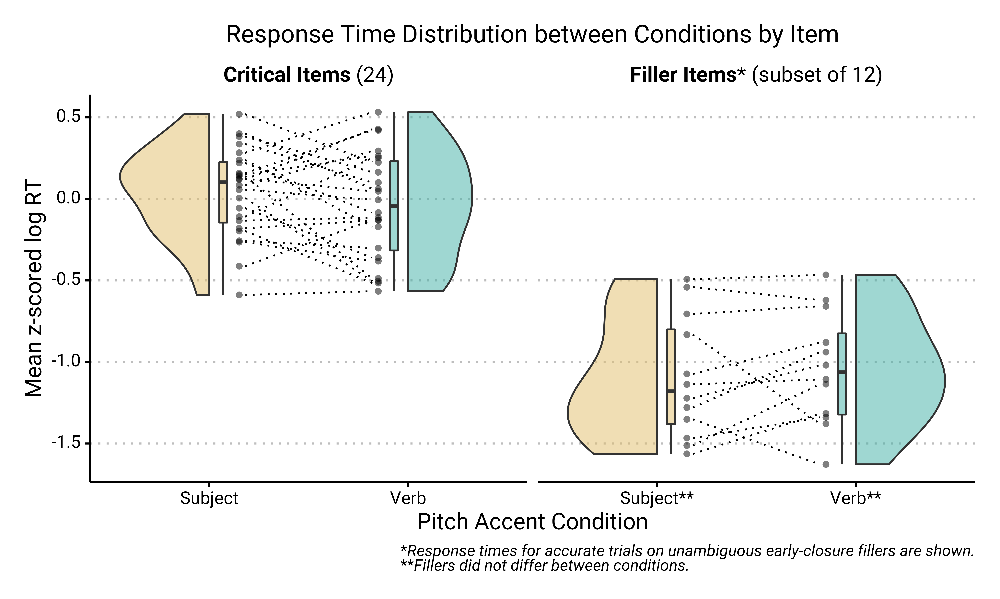

```{r opts}
knitr::opts_chunk$set(
  comment = " ",
  echo = TRUE,
  message = TRUE,
  warning = TRUE,
  R.options = list(width = 80)
)
```

## Raincloud Plots

```{r, echo=FALSE, message=FALSE}
library(tidyverse)
theme_set(mdthemes::md_theme_clean())
theme_update(plot.background = element_blank())
options(dplyr.summarise.inform = FALSE)
```

Geoms for rainplots (a.k.a. split violin plots) already exist, but you might have a very special case where you have pairs of rainplots and you want to track the change in individual datapoints between the rainplot distributions.

For example, say you want to track the height of a plant species across two timepoints and you want to communicate three information:

1. The change in the distribution of plant heights between timepoints.

2. The individual variation in height ("intercept").

3. The individual variation in change of height between timepoints ("slope").

And the data looks like this:

```{r}
set.seed(1234)
plants <- tibble(Species = "Dwarf",
                 Plant = rep(factor(1:100), 2),
                 Timepoint = rep(c("First", "Second"), each = 100),
                 Height = c(rnorm(100, 10, 5), rnorm(100, 20, 8)))

plants %>% 
  group_by(Timepoint) %>% 
  summarize(across(Height, list(mean = mean, sd = sd), .names = "{col}_{fn}"))
```

You can use `geom_violhalf()` from the `{see}` package to do this:

```{r}
library(see)
ggplot(plants, aes(Timepoint, Height, fill = Timepoint)) +
  geom_violinhalf() +
  geom_point(aes(group = Plant),
             position = position_nudge(-.05),
             alpha = 0.5, shape = 16) +
  geom_line(aes(group = Plant),
            position = position_nudge(-.05))
```

But it'd look better if the lines don't cross over the raincloud for the first timepoint.

`geom_paired_raincloud()` automatically flips the first raincloud for you! You do get a warining that there are overlapping points, but that's because the x-axis is categorical and {ggplot2} thinks that flipping the raincloud intrudes into a different category. AFAIK you don't lose any data despite this warning, but you should double check to be sure.


```{r, message=FALSE}
devtools::source_url("https://raw.githubusercontent.com/yjunechoe/geom_paired_raincloud/master/geom_paired_raincloud.R")

ggplot(plants, aes(Timepoint, Height, fill = Timepoint)) +
  geom_paired_raincloud()
```

We can add individual points and lines onto this plot in a similar way, except you need to use a 2-length vector for `position_dodge()`.

```{r, warning = FALSE}
plants %>% 
  # arrange by individual plant
  arrange(Plant) %>% 
  ggplot(aes(Timepoint, Height, fill = Timepoint)) +
  geom_paired_raincloud() +
  geom_point(aes(group = Plant),
             position = position_nudge(c(.05, -.05)),
             alpha = 0.5, shape = 16,
             show.legend = FALSE) +
  geom_line(aes(group = Plant),
            position = position_nudge(c(.05, -.05)))
```

<aside>
**NOTE**: you need to make sure that the data is arranged by the variable you're using for the `group` aesthetic (in this case, `Plant`) before being passed into `ggplot()` for `position_nudge()` in the other geoms to work properly (sorry it's a bit hacky):
</aside>

`geom_paired_raincloud` works as long as the grouping is of length two (i.e., as long as you're comparing distribution between two levels).

Let's modify the `plants` dataset to include another species of plant:

```{r, warning = FALSE}
plants2 <- plants %>% 
  bind_rows(
    tibble(Species = "Giant",
           Plant = rep(factor(101:200), 2),
           Timepoint = rep(c("First", "Second"), each = 100),
           Height = c(rnorm(100, 30, 5), rnorm(100, 50, 8)))
  )

plants2 %>% 
  group_by(Species, Timepoint) %>% 
  summarize(across(Height, list(mean = mean, sd = sd), .names = "{col}_{fn}"))
```


In this new plot, I just added `facet_wrap(~Species)`

```{r, warning = FALSE}
plants2 %>% 
  arrange(Plant) %>% 
  ggplot(aes(Timepoint, Height, fill = Timepoint)) +
  geom_paired_raincloud() +
  geom_point(aes(group = Plant),
             position = position_nudge(c(.05, -.05)),
             alpha = 0.5, shape = 16,
             show.legend = FALSE) +
  geom_line(aes(group = Plant),
            position = position_nudge(c(.05, -.05))) +
  facet_wrap(~Species)
```

`geom_paired_raincloud()` isn't particularly useful for plotting comparisons between more than two levels, so it throws a warning when that's the case:

```{r}
# Adding a third timepoint
plants3 <- plants %>% 
  bind_rows(tibble(Species = "Dwarf",
                   Plant = factor(1:100),
                   Timepoint = "Third",
                   Height = rnorm(100, 40, 10)))

plants3 %>% 
  group_by(Timepoint) %>% 
  summarize(across(Height, list(mean = mean, sd = sd), .names = "{col}_{fn}"))
```

```{r, warning = FALSE}
plants3 %>% 
  arrange(Plant) %>% 
  ggplot(aes(Timepoint, Height, fill = Timepoint)) +
  geom_paired_raincloud() +
  geom_point(aes(group = Plant),
             position = position_nudge(c(.05, -.05)),
             alpha = 0.5, shape = 16,
             show.legend = FALSE) +
  geom_line(aes(group = Plant),
            position = position_nudge(c(.05, -.05)))
```


But I think `geom_paired_raincloud()` works great if you have the right data. Here's an example from my recent work, looking at the variation in how subjects respond to stimuli when they're presented in one condition (Subject Accent) compared to the other (Verb Accent).

```{r, echo = FALSE}

```

The above plot is a combination of `geom_paired_raincloud()`, `geom_point()`, `geom_line()`, and `geom_boxplot()`. I like that you can employ all these aesthetics at once without making the plot too overwhelming. I've included the important part of the code here and the full code is available at the [github repo for this research project](https://github.com/yjunechoe/Semantic-Persistence).

```{r, eval = FALSE}
rainplot_data %>% 
  ggplot(aes(x = Cond, y = z_RT, fill = Cond)) +
  geom_paired_raincloud(alpha = .5) +
  geom_point(aes(group = Item),
             position = position_nudge(c(.15, -.15)),
             alpha = .5, shape = 16) +
  geom_line(aes(group = Item),
            position = position_nudge(c(.13, -.13)),
            linetype = 3) +
  geom_boxplot(position = position_nudge(c(.07, -.07)),
               alpha = .5, width = .04, outlier.shape = " ") +
  facet_wrap(~Type, scales = "free_x") +
  ...
```

<aside>
Notice how I use `position_nudge()` to make sure that the points, lines, and boxplots are side-by-side and not overlapping with each other.
</aside>

