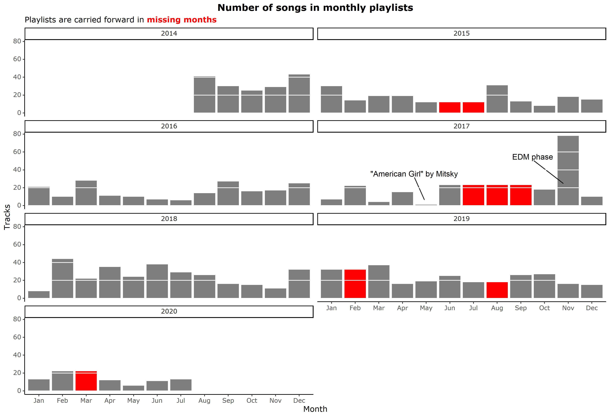
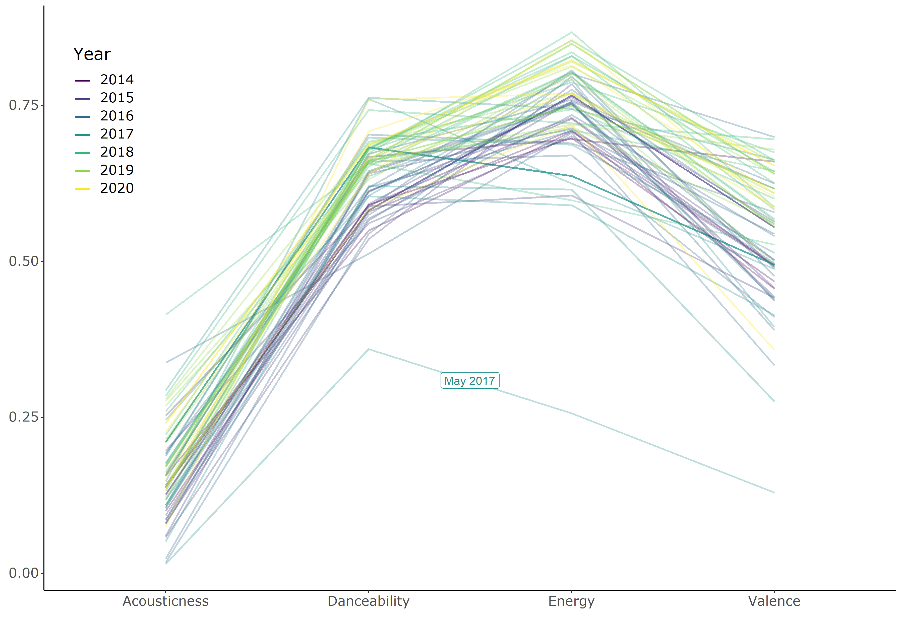
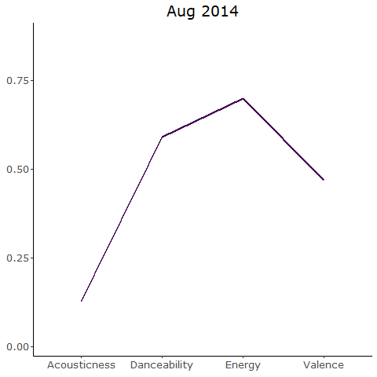
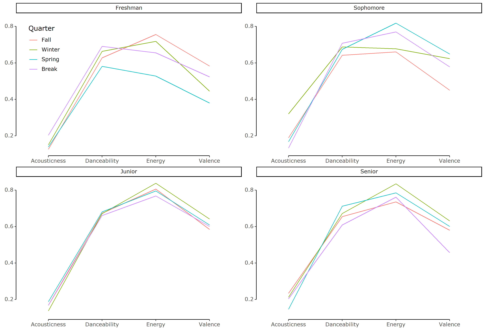
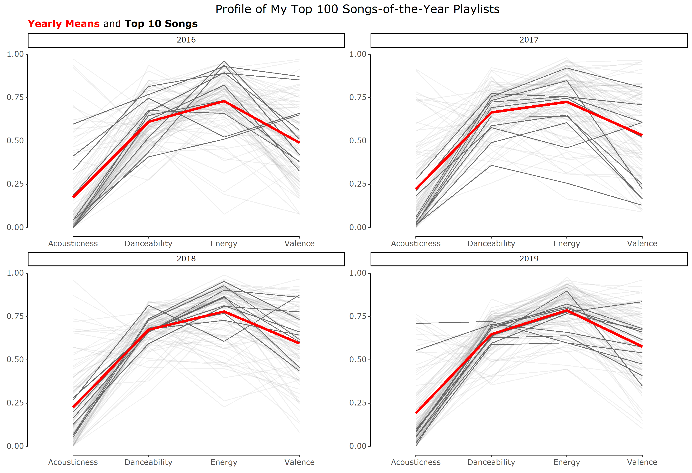

```{r opts}
knitr::opts_chunk$set(
  comment = " ",
  echo = TRUE,
  message = TRUE,
  warning = TRUE,
  R.options = list(width = 80)
)
```

## Background

One of my longest running habits is making monthly playlists. At the start of every month, I create a new playlist for that month and add songs that I like. Some songs are carried over from the previous month's playlist and others are songs that I newly discover, but they're all representative of the songs that I'm "into" for that month.

I've been doing this for many years, and have the best record of my monthly playlists for the past 6 years, which is how long I've been using spotify. So when I saw people talking about `{spotifyr}` - an R wrapper for Spotify's [web API](https://developer.spotify.com/documentation/web-api/) - on twitter, I decided to take a stab at analyzing my monthly playlists ([**code here**](https://github.com/yjunechoe/spotifyr)).

<p>

```{r, echo = FALSE, out.width = '20%', fig.align='center'}
knitr::include_graphics('spotify.png', error = FALSE)
```


## Analysis #1 - Size of monthly playlists over time

When I first pulled information about my Spotify account, I noticed that I had some gaps in my monthly playlists. This was a special case of non-random missing data: when I didn't make a new playlist for the month, it's because I didn't think that there was a substantial change in what I'm jamming to from the previous month. The `{zoo}` package, which I didn't know about before, came in very handy here for dealing with this missingness with its `na.locf()` ([Last Observation Carried Forward](https://www.rdocumentation.org/packages/zoo/versions/1.8-8/topics/na.locf)) function.

After some more cleaning steps, I first made a simple plot that counted the number of songs that each monthly playlist had.



There are some interesting things I notice, and here's some context for them.

- 2014, the year I began using Spotify, has high number of songs per playlist. This makes sense because the transition period involved a lot of transferring-over-in-bulk of my favorite music from iTunes (which I used previously). 

- The three consecutive months of missing playlists in 2017 was over a summer camp. I had forgotten about that until I started this analysis, but for that summer I just kept one playlist called "Summer 2017."

- Both the playlist with the most songs (78) and the playlist with the least songs (1) are in 2017. That was the year when I was exposed to a lot with different music genres from ~~going to parties~~ my friends. That was also my Sophomore year, which was a hot mess, but that's a story for another time. You can get a better sense of my music taste being all over the place in the next section.

- **May 2017** was the month of _sad azn_ vibes. My playlist had a single song, which was [American Girl by Mitski](https://www.youtube.com/watch?v=u_hDHm9MD0I) and I think that says everythihng.

- In **November 2017**, the month with the largest playlist, a friend who was known for having a great taste in music shared with me their playlist of 200+ EDM songs. I never really got into EDM previously but that was a gamechanger. I kind of went through an EDM phase for a short while after that, and November 2017 playlist is still the playlist I go back to when I want to listen to some good EDM.

- The missing playlist of **March 2020** was at perhaps the busiest time of my life - I was juggling my thesis, finals, grad school visits/decisions, finishing up my graduation requirements, moving out of campus back to Korea, and, of course, dealing with the pandemic. Makes sense why that month is missing its playlist.


## Analysis #2 - Audio features

The real deal of Spotify API is actually the **audio features**, which Spotify calculates using their special algorithms. Some of the features are listed in the table below (adopted from the [documentation](https://developer.spotify.com/documentation/web-api/reference/tracks/get-several-audio-features/)). Of these, I decided to narrow down to _acousticness_, _danceability_, _energy_, and _valence_ because others didn't really show much variation (e.g., I don't listen to live-recorded music on Spotify, so _liveness_ is always near zero).

```{r, echo = FALSE, message = FALSE}
library(tidyverse)
library(gt)
library(rvest)
features <- read_html("https://developer.spotify.com/documentation/web-api/reference/tracks/get-several-audio-features/") %>% 
  html_node(xpath = "/html/body/div[1]/div[2]/div/main/article/div[3]/table[3]") %>% 
  html_table() %>% 
  filter(Key %in% c("acousticness", "danceability", "energy", "instrumentalness",
                    "liveness", "loudness", "speechiness", "tempo", "valence")) %>% 
  select(Feature = Key, Description = `Value Description`)

features %>%
  gt() %>%
  tab_style(
    style = list(
      cell_fill(color = "#99FFEF"),
      cell_text(style = "oblique")
    ),
    locations = cells_body(rows = Feature %in% c("acousticness", "danceability", "energy", "valence"))
  )
```


I was interested in looking at how my music taste changed over time, so for each monthly playlist, I calculated the mean values for these four features and made a line plot:



Some things that pop out:

- Overall, I tend to listen to bright music (high dancibility and energy) but there is still a lot of variation (especially in valence). 

- Acousticness stays pretty low and doesn't seem to correlate much with time. This makes sense because I primarily listen to pop and electric songs, which are both very far from sounding acoustic.

- The one dip in May 2017 is, you guessed it, that playlist with just that one Mitski song. That was the only playlist where the mean danceability and energy values are below 0.5.

- It also looks like I listen to brighter music with every passing year, though this trend is subtle. This it's a bit easier to see in the animation below (especially for energy and valence).



## Analysis #3 - Songs during college

Next, I wanted to focus on my years in college, from Fall 2016 to Spring 2020. For this analysis, I defined time in terms of school years and quarters. While I was a college student, I often felt like the passage of time was defined in terms of quarters, so this scale felt appropriate.

Here is the same line plot, except the feature values are averaged by quarter instead of month, and the plot is now faceted by school year:



Observations:

- The trend in increasing positivity can be observed in this plot as well (with my Junior year coming out on top).

- I was actually wondering whether I'd see a pattern by quarter, but there doesn't seem to be any strong ones. 


## Analysis #4 - "My Top 100" playlists

In my last analysis, I move from my monthly playlists to the end-of-the-year playlists that Spotify makes for you every year. 

For this, I grabbed audio features of songs in my yearly top 100 playlists from 2016-2019. In this graph, each line represents a song and the top 10 most listened to song of each year are emphasized in black. The thick red line in each panel represents the average of the songs for that year.



Some observations on the variation in audio features among my top 100 playlists:

- Although the monthly averages in the previous graphs showed extremely low acousticness values (never going above 0.5), that actually hid a lot of variation. You can see that a good number of songs with high acousticness make it to my top 100 (and sometimes even top 10) songs, but that number seems to gradually decline over time. The song with highest acousticness, [Ripchord by Rilo Kiley](https://www.youtube.com/watch?v=IqHKGcujap0) comes from my 2016 playlist. Rilo Kiley is an indie rock band that had a strong influence on my music taste during high school, so it's no surprise that this song made it there.

- There's also a trend of _decreasing overall variability_ in the audio features of my top 100 songs. Perhaps this means that I'm narrowing in on my true music taste? Or maybe that I'm going through a phase in music taste? It's kind of hard to tell but interesting nonetheless.


## Conclusion

I didn't really dig too deeply into the acoustic profile of the songs I listen to in this post, and I doubt that Spotify's list of audio features are comprehensive enough to describe my music taste, but this was a cool exercise!

And although I ignored several of the audio features because they weren't very informative for the songs I listen to, I thought I should at least leave a summary table showing the mean values for all features that I gave in the table above!


```{r, echo = FALSE}
features %>% 
  inner_join(
    tribble(
      ~Feature, ~Average,
      "acousticness",   0.16,
      "danceability",   0.64,
      "energy",   0.75,
      "instrumentalness",   0.02,
      "liveness",   0.19,
      "loudness",  -4.95,
      "speechiness",   0.08,
      "tempo", 120.25,
      "valence",   0.55
    ),
    by = "Feature"
  )%>% 
  gt()
```

