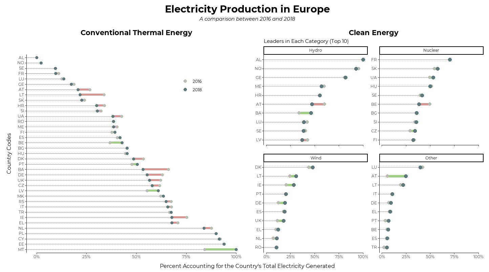

```{r opts}
knitr::opts_chunk$set(
  comment = " ",
  echo = TRUE,
  message = TRUE,
  warning = TRUE,
  R.options = list(width = 80)
)
```

## Visualization

&nbsp;

```{r echo=FALSE, layout='l-body-outset'}

```

### Things I learned

- `geom_dumbbell()` from `{ggalt}`

- `coord_capped_cart()` and `facet_rep_wrap()` from `{lemon}`

- Using the `reorder_within()` + `facet_wrap(scales = "free_y")` + `scale_y_reordered()` combo to sort within facets.

- Using `override.aes` argument to manipulate legend aesthetics _after_ they're generated by the `geom_*()`s

- Using `slice_max()` instead of `top_n()` to catch up with the new `{dplyr}` update

### Things to improve

- Font sizing and image resolution

- Placement and size of legend is sorta awkward.

- Plot feels too... empty. I think I treated this too much like a figure for a journal article. Maybe add some background color next time? 

## Code

Also available on [github](https://github.com/yjunechoe/tidytuesday/blob/master/Scripts/tidytuesday_2020_32.R)

```{r plot, eval=F, message=F, warning=F}
library(tidyverse)
library(tidytuesdayR)
library(lemon)
library(ggalt)
library(patchwork)
library(extrafont)

theme_set(theme_classic())

### Data

tuesdata <- tidytuesdayR::tt_load('2020-08-04')

energy_types <- tuesdata$energy_types

energy_types_tidy <- energy_types %>% 
  pivot_longer(where(is.double), names_to = "Year", values_to = "GWh")


plot_data <- energy_types_tidy %>% 
  add_count(country, Year, wt = GWh, name = "Total") %>% 
  mutate(GWh_prop = GWh/Total) %>% 
  select(-country_name, -GWh, -Total , -level) %>% 
  filter(Year %in% c(2016, 2018))
  

### Plotting

p1 <- plot_data %>% 
  filter(type == "Conventional thermal") %>% 
  pivot_wider(names_from = Year, values_from = GWh_prop) %>% 
  mutate(country = fct_reorder(country, `2018`, max, .desc = TRUE)) %>% 
  mutate(increase = (`2018` - `2016`) > 0) %>%  
  ggplot() +
  geom_dumbbell(
    aes(y = country, x = `2016`, xend = `2018`, color = increase),
    dot_guide = TRUE, dot_guide_size = 0.25,
    size = 2, colour_x = "#babfb6", colour_xend = "#5f787b"
  ) +
  scale_color_manual(values = c("#d69896", "#a1cf86"), labels = c("2016", "2018")) +
  guides(color = guide_legend(override.aes = list(color = c("#babfb6", "#5f787b"), size = 3))) +
  labs(title = "Conventional Thermal Energy",
       y = "Country Codes",
       color = NULL) +
  theme(legend.position = c(.75, .85),
        axis.title.y = element_text(size = 12, vjust = 5))

p2 <- plot_data %>% 
  filter(type != "Conventional thermal") %>% 
  pivot_wider(names_from = Year, values_from = GWh_prop) %>% 
  mutate(type = fct_lump(type, n = 3, w = `2018`)) %>% 
  group_by(type, country) %>% 
  summarize(`2016` = sum(`2016`), `2018` = sum(`2018`)) %>% 
  slice_max(`2018`, n = 10, with_ties = FALSE) %>% 
  mutate(country = tidytext::reorder_within(country, `2018`, type)) %>% 
  mutate(increase = (`2018` - `2016`) > 0) %>%  
  ggplot() +
  geom_dumbbell(
    aes(y = country, x = `2016`, xend = `2018`, color = increase),
    dot_guide = TRUE, dot_guide_size = .4,
    size = 2.5, colour_x = "#babfb6", colour_xend = "#5f787b",
    show.legend = FALSE
  ) +
  scale_color_manual(values = c("#d69896", "#a1cf86")) +
  tidytext::scale_y_reordered() +
  facet_rep_wrap(~type, scales = "free_y") +
  labs(title = "Clean Energy",
       subtitle = "Leaders in Each Category (Top 10)",
       y = NULL)

patched <- p1 + p2 &
    coord_capped_cart(bottom = "both") &
    scale_x_continuous(labels = scales::percent) &
    labs(x = NULL) &
    theme(
      plot.title = element_text(hjust = 0.5, size = 16, face = "bold"),
      text = element_text(family = "Montserrat"),
      panel.grid.major.y = element_blank(),
      plot.margin = unit(c(.4,.2,.2,.4), "cm"),
      plot.background = element_rect(color = "transparent")
    )

patched + plot_annotation(title = "Electricity Production in Europe",
                  subtitle = "A comparison between 2016 and 2018",
                  caption = "Percent Accounting for the Country's Total Electricity Generated",
                  theme = list(plot.title = element_text(size = 22),
                               plot.subtitle = element_text(face = "italic", hjust = .5),
                               plot.caption = element_text(size = 12, hjust = .5)))
```
