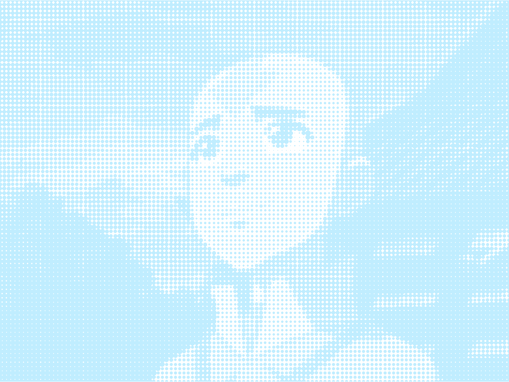

```{r opts}
knitr::opts_chunk$set(
  comment = " ",
  echo = TRUE,
  message = TRUE,
  warning = TRUE,
  R.options = list(width = 80)
)
```

## Visualization

&nbsp;

```{r echo=FALSE}

```

### Things I learned

- Really basic image manipulation with `{magick}`

- That you can get away with not doing the _data_ part of _data_ visualization for TidyTuesday

### Things to improve

- Should've picked a better color to represent <span class="sc">air</span> for Aang.

- Not sure why it looks like white grid lines are there. All my attempts at getting rid of them failed, so I've just concluded that they're likely an [optical illusion](https://en.wikipedia.org/wiki/Grid_illusion#:~:text=The%20Hermann%20grid%20illusion%20is,looking%20directly%20at%20an%20intersection.).

## Code

Also available on [github](https://github.com/yjunechoe/tidytuesday/blob/master/Scripts/tidytuesday_2020_33.R)

```{r plot, eval=F, message=F, warning=F}
library(tidyverse)
library(magick)
library(gganimate)

aang <- image_read("https://vignette.wikia.nocookie.net/avatar/images/a/ae/Aang_at_Jasmine_Dragon.png")
iroh <- image_read("https://vignette.wikia.nocookie.net/avatar/images/c/c1/Iroh_smiling.png")
sokka <- image_read("https://vignette.wikia.nocookie.net/avatar/images/c/cc/Sokka.png")
toph <- image_read("https://vignette.wikia.nocookie.net/avatar/images/4/46/Toph_Beifong.png")

# Script by Georgios Karamanis adapted and wrapped into a function
# - from https://github.com/gkaramanis/aRt/blob/master/split-bar/points-portraits.R
img_to_df <- function(img, index) {
  
  img <- image_convert(img, colorspace = "gray")
  
  img_w <- image_info(img)$width
  img_h <- image_info(img)$height
  
  if (img_w >= img_h) {
    img <- image_resize(img, "120")
  } else {
    img <- image_resize(img, ("x120"))
  }
  
  img_array <- drop(as.integer(img[[1]]))
  rownames(img_array) <- 1:nrow(img_array)
  colnames(img_array) <- 1:ncol(img_array)
  
  as.data.frame.table(img_array) %>% 
    `colnames<-`(c("y", "x", "b")) %>% 
    mutate(
      across(everything(), as.numeric),
      bf = 1 - b / 255
    ) %>% 
    mutate(character_id = index)
}

plot_data <- imap_dfr(list(aang, iroh, sokka, toph), ~img_to_df(.x, .y)) %>% 
  group_by(character_id) %>% 
  mutate(point_id = 1:n()) %>% 
  ungroup() %>% 
  mutate(across(contains("id"), as.factor))

anim <- ggplot(plot_data) +
  geom_point(aes(x = x, y = y, size = bf, group = point_id, color = character_id),
             shape = 16, show.legend = FALSE) +
  scale_y_reverse() +
  scale_size_continuous(range = c(0, 4)) +
  scale_color_manual(values = c("#C0EDFF", "#B33000", "#206BA4", "#8B4513")) +
  coord_fixed(expand = FALSE) +
  theme_void() +
  theme(panel.grid = element_blank()) +
  transition_states(id)

animate(anim, width = 12, height = 9, units = "in", res = 120)
```

