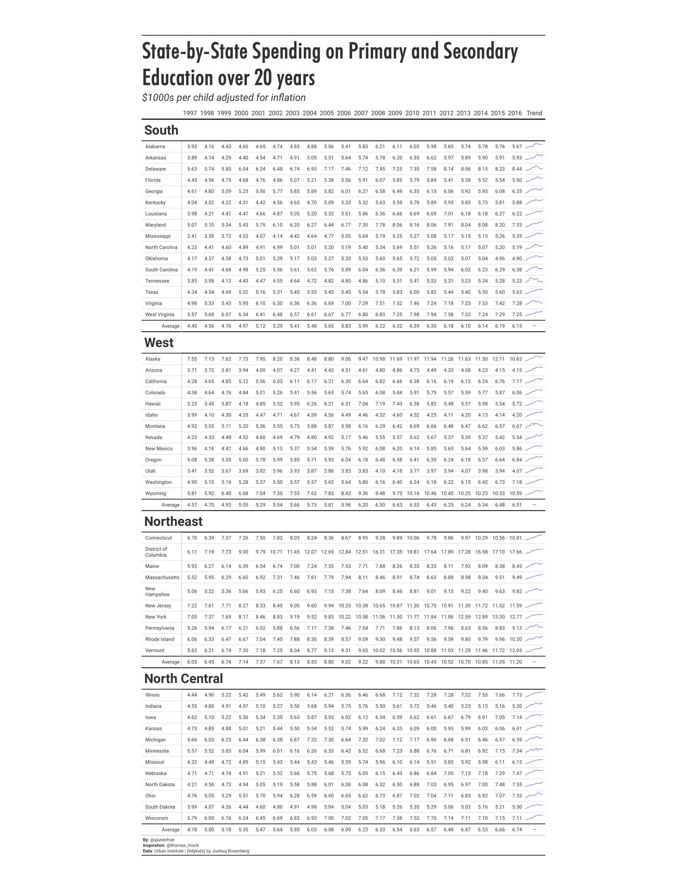

```{r opts}
knitr::opts_chunk$set(
  comment = " ",
  echo = TRUE,
  message = TRUE,
  warning = TRUE,
  R.options = list(width = 80)
)
```

## Visualization

_I had difficulty embedding an HTML table without overriding its styles so [**the table is also available on its own here**](tidytuesday_2020_38_table.html)._

```{r, echo = FALSE, layout = 'l-screen'}

```

### Things I learned

- Basics of working with tables and {gt}^[Many thanks to Thomas Mock's blog posts on {gt} [(1)](https://themockup.blog/posts/2020-05-16-gt-a-grammer-of-tables/) [(2)](https://themockup.blog/posts/2020-09-04-10-table-rules-in-r/), a well as to the developers of {gt} for what I think is [one of the most comprehensive vignette](https://gt.rstudio.com/reference/index.html) I've ever seen for a package!]


- Putting different font styles together in a nice way

### Things to improve

- Summarize the data a bit more so the table isn't huge

- Add conditional formatting (learn how `tab_style()` and `tab_options()` work)

- Figure out how to save {gt} tables into pdf or png

- Figure out how to include an html table without overriding css styles

## Code

Also available on [github](https://github.com/yjunechoe/tidytuesday/blob/master/Scripts/tidytuesday_2020-38.R)

```{r, eval=FALSE}
library(tidyverse)
library(gt)

kids <- tidytuesdayR::tt_load("2020-09-15")$kids


# TABLE DATA

state_regions <- setNames(c(as.character(state.region), "Northeast"), c(state.name, "District of Columbia"))

kids_tbl_data <- kids %>% 
  filter(variable == "PK12ed") %>%
  mutate(region = state_regions[state]) %>% 
  select(region, state, year, inf_adj_perchild) %>% 
  pivot_wider(names_from = year, values_from = inf_adj_perchild) %>%
  mutate(Trend = NA) 


# SPARKLINE

plotter <- function(data){
  data %>% 
    tibble(
      year = 1997:2016,
      value = data
    ) %>% 
    ggplot(aes(year, value)) +
    geom_line(size = 10, show.legend = FALSE) +
    theme_void() +
    scale_y_continuous(expand = c(0, 0))
}

spark_plots <- kids_tbl_data %>% 
  group_split(state) %>% 
  map(~ flatten_dbl(select(.x, where(is.numeric)))) %>% 
  map(plotter)


# TABLE

kids_tbl <- kids_tbl_data %>% 
  gt(
    groupname_col = 'region',
    rowname_col = 'state'
  ) %>% 
  fmt_number(
    columns = 3:22
  ) %>% 
  summary_rows(
    groups = TRUE,
    columns = 3:22,
    fns = list(Average = ~mean(.))
  ) %>% 
  text_transform(
    locations = cells_body(vars(Trend)),
    fn = function(x){
      map(spark_plots, ggplot_image, height = px(15), aspect_ratio = 4)
    }
  ) %>%
  tab_header(
    title = md("**State-by-State Spending on Primary and Secondary Education over 20 years**"),
    subtitle = md("*$1000s per child adjusted for inflation*")
  ) %>% 
  tab_source_note(
    md("**By**: @yjunechoe<br>
        **Inspiration**: @thomas_mock<br>
        **Data**: Urban Institute | {tidykids} by Joshua Rosenberg")
  ) %>% 
  tab_style(
    style = list(
      cell_text(font = "Futura MdCn BT")
    ),
    locations = list(
      cells_title(groups = "title")
    )
  ) %>%
  tab_options(
    table.width = 50,
    heading.align = "left",
    heading.title.font.size = 72,
    heading.subtitle.font.size = 32,
    row_group.font.size = 42,
    row_group.font.weight = 'bold',
    row_group.border.top.color = "black",
    row_group.border.bottom.color = "black",
    table.border.top.color = "black",
    heading.border.bottom.color = "white",
    heading.border.bottom.width = px(10),
    table.font.names = "Roboto",
    column_labels.font.size = 20,
    column_labels.border.bottom.color = "black",
    column_labels.border.bottom.width= px(3),
    summary_row.border.color = "black", 
    summary_row.background.color = "#c0c5ce",
    table.border.bottom.color = "black"
  )
```

