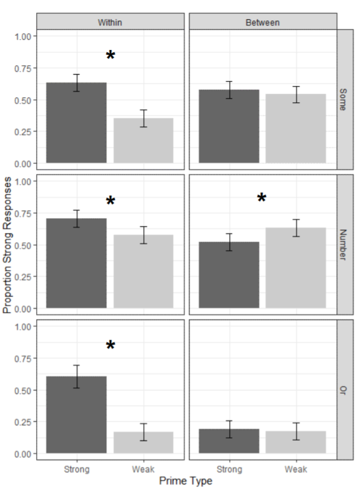

```{r opts}
knitr::opts_chunk$set(
  comment = " ",
  echo = TRUE,
  message = TRUE,
  warning = TRUE,
  R.options = list(width = 80)
)
```


```{r, echo = FALSE, message = FALSE}
library(extrafont)
```

_This is the first installment of **plot makeover** where I take a plot in the wild and make very opinionated modifications to it._

## Before

Our plot-in-the-wild comes from the recent [AMLAP 2020](https://amlap2020.github.io/) conference, where I presented my [thesis research](https://osf.io/fjkp9/) and had the opportunity to talk with and listen to expert psycholinguists around the world. The plot that I'll be looking at here is <span class="sc">Figure 3</span> from the [abstract](https://amlap2020.github.io/a/272.pdf) of a work by E. Matthew Husband and Nikole Patson[@HusbandEtAl2020AMLaP].

```{r fig.cap="Plot from Husband and Patson (2020)", echo = FALSE, out.width = 500, out.extra="class=external", fig.align='center'}

```

What we have is a 2-by-3 grid of 6 pairs of bar plots with error bars, grouped at three levels which are mapped in the following way:

- First level is mapped to the <span class="sc">grid column</span>.

- Second level is mapped to the <span class="sc">grid row</span>.

- Third level is mapped to the <span class="sc">x-axis</span>.

To get a better sense of what they did, and to make data for my new plot, I have recreated the original plot below:^[But note that this is likely **not** how the original plot was generated: the authors were likely feeding ggplot2 with the raw data (involving 1s and 0s in this case), but here I am just grabbing the summary statistic that was mapped to the bar aesthetic (hence my decision to name the y variable `barheight`).]

**1. Data**

```{r original, eval = FALSE}
library(tidyverse)
df <- crossing(level_1 = fct_inorder(c("Within", "Between")),
               level_2 = fct_inorder(c("Some", "Number", "Or")),
               level_3 = factor(c("Strong", "Weak")))
df$barheight <- c(.63, .35, .72, .55, .61, .15, .60, .55, .52, .63, .17, .16)

df
```

<aside>
The numbers for `barheight` were eyeballed from looking at the original plot, of course.
</aside>

```{r original, echo = FALSE, message = FALSE}
```


**2. Plot**

```{r, fig.width = 5, fig.height = 8, fig.align='center'}
df %>% 
  ggplot(aes(level_3, barheight)) +
  geom_col(
    aes(fill = level_3),
    show.legend = FALSE
  ) +
  geom_errorbar(
    aes(ymin = barheight - .05, ymax = barheight + .05),
    width = .1) +
  facet_grid(level_2 ~ level_1) +
  theme_bw() +
  scale_fill_manual(values = c('grey40', 'grey80')) +
  ylim(0, 1) +
  labs(
    y = "Proportion of Strong Responses",
    x = "Prime Type") +
  theme_bw()

```

<aside>
The original plot for comparison:
```{r, echo=FALSE}

```
</aside>

## My Plan

**Major Changes**:

- Flatten the grid in some way so that everything is laid out left-to-right and you can make comparisons horizontally.

- Cap the y axis to make it clear that the values (proportions) can only lie between 0 and 1.

**Minor Changes**:

- Remove grid lines

- Increase space between axis and axis titles.

- Remove boxes around strip labels

- Make strip (facet) labels larger and more readable.

- Increase letter spacing (probably by changing font)


## After

I actually couldn't settle on one final product,^[I ran the first plot by a friend who has a degree in design, and she recommended several changes that eventually ended up being the second plot. Some major pointers were removing border lines from the legend, removing x-axis tick marks, and applying color/shade.] so here are two plots that incorporate the changes that I wanted to make. I think that both look great and you may prefer one style over the other depending on what relationships/comparisons you want your graph to emphasize.


### Point-line plot

```{r after_pointplot, layout = 'l-body-outset'}
dodge <- position_dodge(width = .5)

df %>% 
  mutate(level_3 = as.numeric(level_3)) %>% 
  ggplot(aes(x = level_3, y = barheight, group = level_1)) +
  geom_point(position = dodge) + 
  geom_errorbar(
    aes(ymin = barheight - .05, ymax = barheight + .05),
    width = .2,
    position = dodge
  ) +
  geom_line(
    aes(linetype = level_1),
    position = dodge
  ) +
  facet_wrap(~ level_2) +
  scale_x_continuous(
    breaks = 1:2,
    labels = levels(df$level_3),
    expand = expansion(.2),
  ) +
  ylim(0, 1) +
  lemon::coord_capped_cart(left = "both") +
  guides(linetype = guide_legend(direction = "horizontal",
                                 title.position = 'top',
                                 title.hjust = .5,
                                 title.theme = element_text(size = 10, face = "plain"),
                                 label.theme = element_text(size = 8, family = "Montserrat"))
  ) +
  labs(
    y = "Strong Responses",
    x = "Prime Type",
    linetype = "Category"
  ) +
  ggthemes::theme_clean() +
  theme(
    text = element_text(family = "Montserrat"),
    legend.position = c(.17, .85),
    legend.background = element_rect(color = 'black', size = unit(.5, 'mm')),
    strip.text = element_text(size = 13),
    plot.margin = margin(5, 5, 5, 5, 'mm'),
    axis.title.x = element_text(vjust = -3),
    axis.title.y = element_text(vjust = 5),
    plot.background = element_blank(),
    panel.grid.major.y = element_blank()
    
  )
```

### Bar plot

```{r after_bar_code, eval=FALSE}
dodge <- position_dodge(width = .5)

df %>% 
  mutate(level_3 = as.numeric(level_3)) %>% 
  ggplot(aes(x = level_3, y = barheight, group = level_1)) +
  geom_col(position = dodge, width = .5, color = 'white', aes(fill = level_1)) +
  scale_fill_manual(values = c("grey30", "grey60")) +
  geom_errorbar(
    aes(ymin = barheight - .05, ymax = barheight + .05),
    width = .2,
    position = dodge
  ) +
  facet_wrap(~ level_2) +
  scale_x_continuous(
    breaks = 1:2,
    labels = levels(df$level_3),
    expand = expansion(.2),
  ) +
  ylim(0, 1) +
  lemon::coord_capped_cart(left = "both") +
  labs(
    y = "Strong Responses",
    x = "Prime Type",
    fill = NULL
  ) +
  ggthemes::theme_clean(base_size=14) +
  theme(
    text = element_text(family = "Montserrat"),
    legend.text = element_text(size = 10),
    legend.key.size = unit(5, 'mm'),
    legend.direction = "horizontal",
    legend.position = c(.17, .85),
    legend.background = element_blank(),
    strip.text = element_text(size = 14),
    axis.ticks.x = element_blank(),
    axis.title.x = element_text(vjust = -3),
    axis.title.y = element_text(vjust = 5),
    panel.grid.major.y = element_blank(),
    plot.background = element_blank(),
    plot.margin = margin(5, 5, 5, 5, 'mm')
  )
```

<aside>
In this second version, I removed `guides()` and distributed its arguments across `labs()` and `theme()`. I kinda like this layout of having a fat `theme()` and it's not too hard to read if you group and sort the arguments.
</aside>

```{r after_bar_plot, echo=FALSE, layout = 'l-body-outset', preview = TRUE}
<<after_bar_code>>
```
