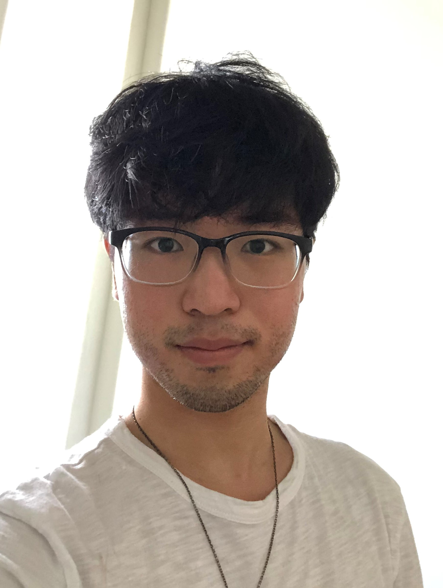

  

  

    <i class="fa fa-graduation-cap" aria-hidden="true" style="padding-right:5px"></i> Education
  

  <li>B.A. (hons.) Northwestern University (2016–20)</li>
  <li>Ph.D. University of Pennsylvania (2020 ~)</li>
  

    <i class="fa fa-lightbulb-o" aria-hidden="true" style="padding-right:5px"></i> Interests
  

  <li>(Computational) Psycholinguistics</li>
  <li>Language Acquisition</li>
  <li>Parsing / Sentence Processing</li>
  <li>Prosody & Information Structure</li> 

  

    <strong style="font-family: Roboto Slab; font-size: 1.2em">
      <i class="fa fa-flask" aria-hidden="true" style="padding-right:12.5px"></i> Methods: 
    </strong>
    Eye-tracking, sentence comprehension, text/speech corpus analysis
  

  

    <strong style="font-family:Roboto Slab; font-size:1.2em">
      <i class="fa fa-code" aria-hidden="true" style="padding-right:5px"></i> Programming: 
    </strong>
    R (fluent) | HTML/CSS/JS (proficient) | Python (coursework)
  

<h3 style="margin: 0px 0px 25px 0px; font-variant:small-caps; text-align:center; font-size:2em; letter-spacing:2px">about</h3>

I am a second year PhD student in [Linguistics at the University of Pennsylvania](https://live-sas-www-ling.pantheon.sas.upenn.edu/). I use computational and behavioral methods to study how comprehenders parse linguistic input, both in real time and at different stages of language development.

I received my B.A. in Linguistics from Northwestern University, where I worked with [Jennifer Cole](https://sites.northwestern.edu/cole/), [Masaya Yoshida](https://faculty.wcas.northwestern.edu/~myo507/), and [Annette D'Onofrio](https://faculty.wcas.northwestern.edu/~akd2621/). I also worked as a research assistant for (and still collaborate with) the [Language, Education, and Reading Neuroscience Lab](https://learnlab.northwestern.edu/)) in Communication Sciences and Disorders. I wrote my thesis on the role of prosodic focus in semantic reanalysis in the processing of garden-path sentences with local attachment ambiguity.

Beyond linguistics research, I have interests in data visualization, science communication, and the R programming language, and I [blog](https://yjunechoe.github.io/blog.html) about these topics in my spare time as a hobby. I'm especially passionate about improving explanatory data viz in academic research and strongly believe that _style_ is just as important as _content_. I am also a [Penn MindCORE](https://mindcore.sas.upenn.edu/) student affiliate and work as a data science tutor for researchers at Penn.

contact me:  yjchoe\@sas.upenn.edu

