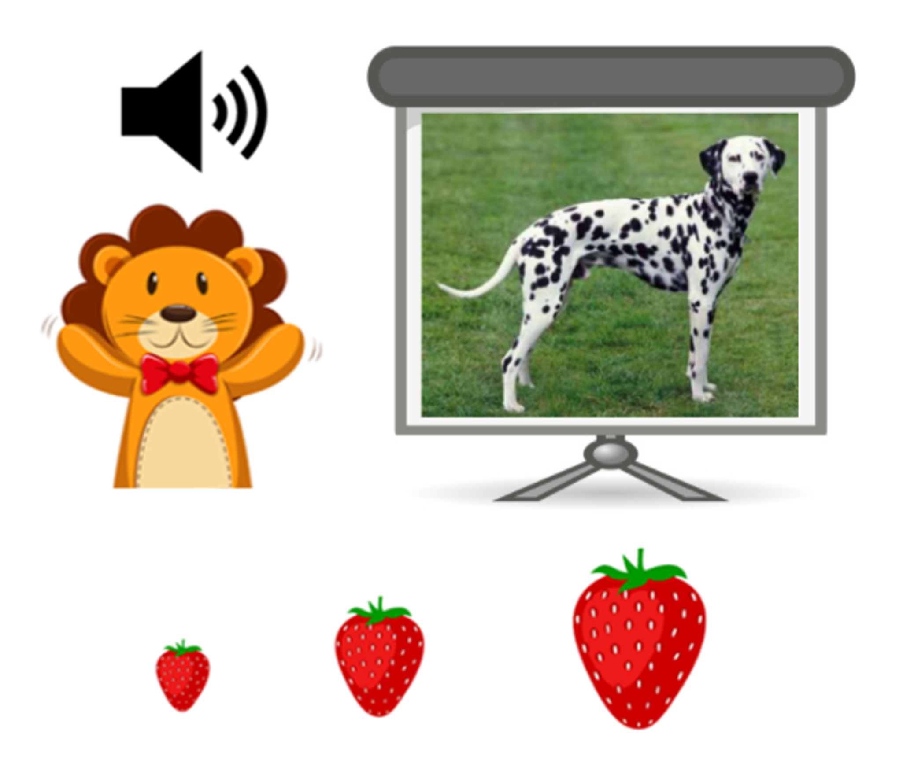
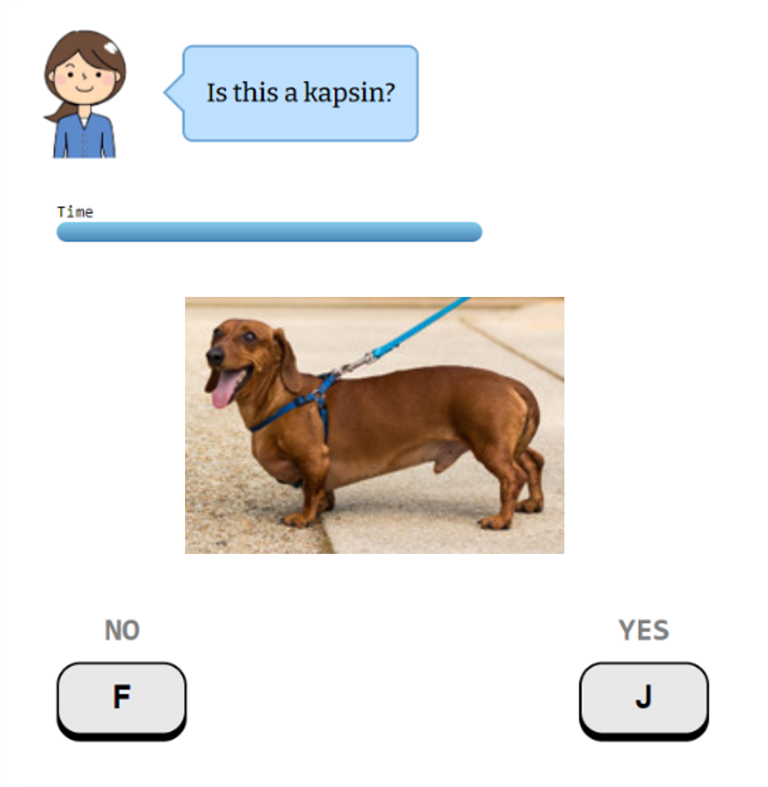
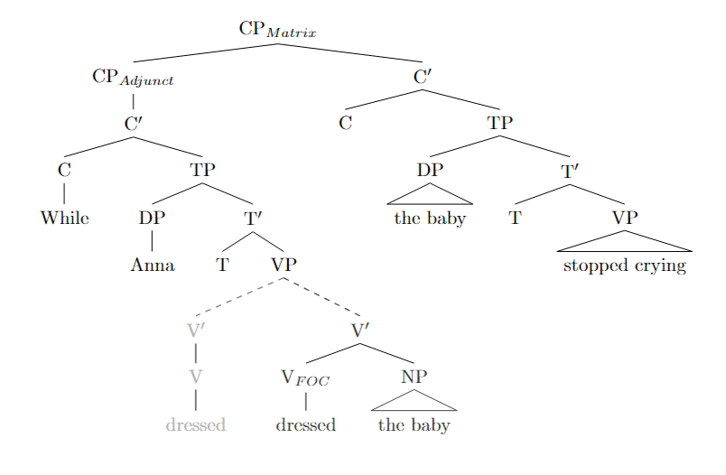
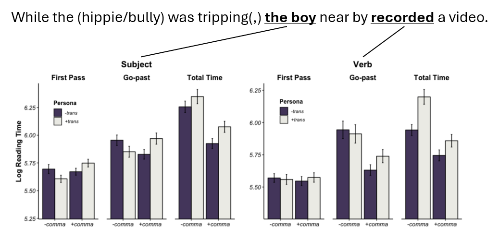
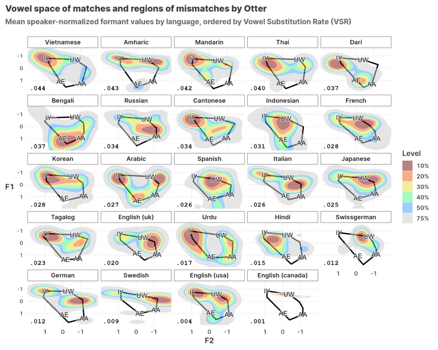
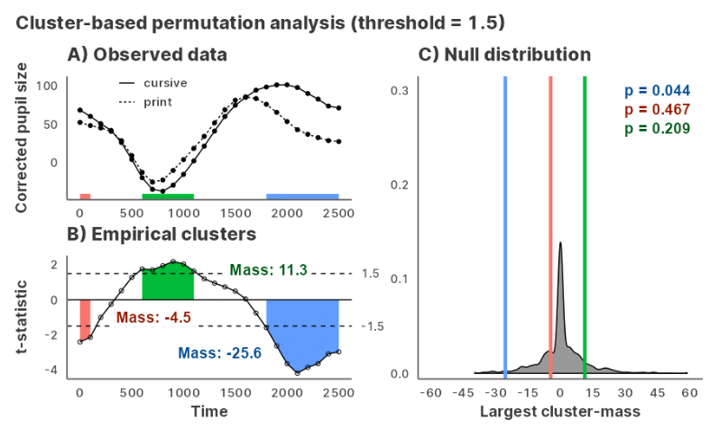
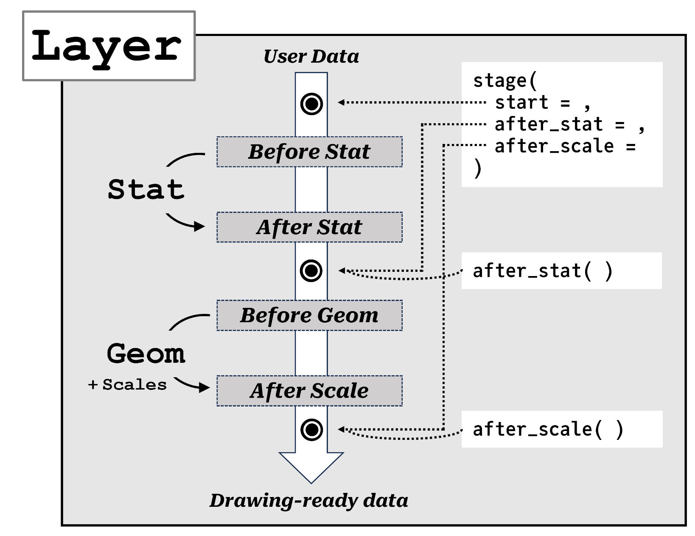

```{css, echo=FALSE}
img {
  max-height: 400px;
  max-width: 500px;
}

.l-body-outset {
  grid-column: middle;
  text-align: center;
  background: lightgrey;
  margin: 1em;
}

.lightbox {
  display: grid;
  justify-content: center;
  text-align: center;
}

.lightbox.open {
  position: fixed;
  z-index: 500;
  width: 100%;
  height: 100%;
  text-align: center;
  top: 0;
  left: 0;
  transition: background 300ms ease-in-out;
  background: rgba(0, 0, 0, 0.8);
}

.lightbox.open img {
  margin: auto;
  position: absolute;
  top: 0;
  left: 0;
  bottom: 0;
  right: 0;
  width: auto;
  max-width: 95%;
  height: auto;
  max-height: 90%;
}

d-article {
  contain: unset !important;
}
```

Watch me talk about my dissertation research! Courtesy of the 38th Annual Conference on Human Sentence Processing ([HSP 2025](https://hsp2025.github.io/)).

<iframe height="400" allow="accelerometer; autoplay; clipboard-write; encrypted-media; gyroscope; picture-in-picture" allowfullscreen src="https://www.youtube.com/embed/asFt5necFD4"></iframe>

<div class="l-body-outset">
# 1) Word Learning and Pragmatics
</div>

My dissertation revisits the classic "subset problem" of ambiguity in word learning: when a child hears a novel word used to refer to an entity in the world, what specific meaning do they hypothesize for the word, given that entities can belong to multiple taxonomic levels (dalmatian? dog? animal?). I am interested in studying the mechanisms underlying the acquisition of hierarchical word meanings in early childhood, from the angles of semantics/pragmatics, distributional learning, and conceptual development.

### Superordinate nouns

<div class="lightbox">


[Choe & Papafragou (2025)](https://yjunechoe.github.io/static/papers/Choe_Papafragou_2025_distributional_signatures_superordinates.pdf)
</div>

Superordinate nouns like "animal" and "fruit" are notoriously difficult to learn for kids, but the reason for that is less understood. In Choe & Papafragou (2025), I demonstrate that the distribution of superordinate nouns – both observed (in corpora of child-directed speech) and expected (by adults, when experimentally manipulated) – is strongly associated with specific frames that highlight semantic breadth, such as "which \_\_\_" and "kind of \_\_\_." I propose that this peculiar distribution of superordinate nouns offers children an initially subtle yet eventually reliable cue for superordinate noun meanings.

In a related study (Choe & Papafragou, submitted) I show that children judge superordinate nouns to be infelicitous when used in contexts that require the speaker to be more specific, such as naming (e.g., A: "What do you call this?" B: "Animal") and ostensive referring (e.g., "Look, this is an animal"). These data highlight a strong and predictable link between meaning and usage in the domain of nominals, and challenge prior reports of conceptual failures in children’s superordinate noun learning.

### Subordinate nouns

<div class="lightbox">


[Choe & Papafragou (2023)](https://www.langcoglab.com/_files/ugd/7cb05b_746c6f11a2214857a94c3ebbc7afa718.pdf)
</div>

In Choe & Papafragou (2023), I investigate how contrasting referents, such as a corgi shown alongside a target dalmatian, narrow the meaning of a novel label at the subordinate level (e.g., "Look! A wug" as specifically meaning 'dalmatian' vs. 'dog'). In a series of word learning experiments, I show that this effect is primarily driven by inferences about speaker intent: learners interpret the referential contrast as a cue to a more specific word meaning, but only if they view it as relevant to the speaker’s choice of label. This suggests that discovering categories for mapping onto language inevitably involves social and pragmatic reasoning about a speaker’s specific perspective on an object that they are trying to communicate.

In ongoing follow-up experiments with 4-to-5-year-olds (Choe & Papafragou, in prep.), I successfully replicate this sensitivity to semantic alternatives and further investigate whether children also incorporate speaker knowledge to reason about the relevant semantic alternatives that constrain word meaning.

<div class="l-body-outset">
# 2) Human Sentence Processing
</div>

Despite the complexity of language, humans have a remarkable ability to comprehend utterances rapidly and effortlessly in real time. This is largely thanks to the architecture of the human parser being incremental and top-down, optimized for quickly integrating new information. But what happens when the parser encounters ambiguous material? I am interested in the mechanistic issues relating to the processes of disambiguation and reanalysis, as well as the representational issues relating to the kinds of information available to the parser at different stages of processing.

### Prosodic focus in garden-path reanalysis

<div class="lightbox">


[Choe, Yoshida, & Cole (2022)](static/papers/Choe_Yoshida_Cole_2022_prosodic_focus_garden_path_reanalysis.pdf)
</div>

This research (also my BA thesis) investigates how prosodic features like the pitch accent influence the parser's ability to recover from garden path sentences. In a speeded auditory comprehension task, I find that placing a pitch accent on verbs in ambiguous sentences makes it harder for listeners to revise their initial misinterpretations. In the context of the experiment design, this data suggests that focus-marking prosody can selectively trigger a deeper semantic processing of the initially incorrect parse, in turn strengthening its resistance to semantic reanalysis. This work showcases the complex interplay between prosody, semantics, and syntax in real-time language comprehension, reaffirming Janet Dean Fodor's (2002) remark that [psycholinguistics cannot escape prosody](https://sprosig.org/sp2002/pdf/fodor.pdf).

### Social information in verb sense disambiguation

<div class="lightbox">


[Choe, Slogget, Yoshida, & D'Onofrio (2019)](https://files.osf.io/v1/resources/w8tqn/providers/osfstorage/5ca285ec8a6a4c00188af3ad?action=download&direct&version=1)
</div>

Verbs like "tripping" and "slaying" form an interesting class of verbs such that they are 1) polysemous (e.g., "tripping" to mean taking a drug vs. causing someone to stumble), 2) the senses differ in argument structure (e.g., "tripping" vs. "tripping + NP"), and 3) information about the agent can bias one meaning over the other (e.g., when we hear "a hippie was tripping ...", we'd likely think of the sense of the verb that involves taking drugs). Exploiting that design, this research investigates whether and how socially-specified agents (i.e., personae) guide ambiguity resolution at the verb during on-line sentence processing. In an eye-tracking-while-reading study, we find that readers use social information to form top-down event representations that influence both immediate processing and later comprehension.

This work has been picked up by my colleague at Northwestern University, [Cassie Davenport](https://sites.northwestern.edu/cmdavenport/).

<div class="l-body-outset">
# 3) Computational Linguistics and Statistical Computing/Graphics
</div>

My interest in psycholinguistics and computational skills have naturally led me to develop some side projects in computational linguistics and statistical computing/graphics. I list a few disjointed projects here.

### Bias in automatic speech recognition systems

<div class="lightbox">


[Choe, Chen, Chan, Li, Gao, & Holliday (2022)](https://aclanthology.org/2022.coling-1.628.pdf)
</div>

This collaborative project with fellow Linguists at the University of Pennsylvania profiled how L2 English speakers' native language backgrounds affect ASR accuracy. We found higher rates of ASR errors for non-native speakers, especially if their native language was not represented in the training data. Additionally, a linguistic analysis of segment-level errors revealed that there are predictable error patterns in the acoustic space that reflect the speakers' L1 phonology and L1-L2 language transfer effects.

A related work from the same group also appeared in [Chan et al. (2022)](https://www.isca-speech.org/archive/interspeech_2022/chan22b_interspeech.html), led by my colleague [May Chan](https://www.ling.upenn.edu/~pikyu/).

### Cluster-based permutation tests with mixed models

<div class="lightbox">


[Choe (2024)](static/papers/Choe_2024_jlmerclusterperm.pdf)
</div>

Cluster-based permutation test is a non-parametric test of difference for time-series data. CPA is a popular choice of analysis in EEG, eyetracking, and other densely-sampled time data, with existing implementations in MATLAB and R. However, current implementations face two limitations. First, model size and complexity is a major bottleneck to performance; researchers must often sacrifice the resolution of the data (via binning and downsampling) and/or forgo modelling group-level differences (by dropping random effects). Second, the algorithmic steps of the CPA are hidden inside monolith functions; this makes the procedure inflexible and difficult to diagnose. I developed the R package [jlmerclusterperm](https://github.com/yjunechoe/jlmerclusterperm/) to address these issues by using the fast MixedModels.jl Julia library as the backend, with a user-centric design that allows an interactive workflow over the individual components of the CPA.

### Sub-layer modularity in the Grammar of Graphics

<div class="lightbox">


[Choe (2022)](static/papers/Choe_2022_SublayerGG.pdf)
</div>

The inner workings of [ggplot2](https://github.com/tidyverse/ggplot2/) are difficult to grasp even for experienced users because its internal object-oriented (ggproto) system is hidden from user- facing functions, by design. This is exacerbated by the foreignness of ggproto itself, which remains the largest hurdle in the user-to-developer transition. However this needs not to be the case: ggplot internals have clear parallels to data wrangling, where data is passed between methods that take inputs and return outputs. Capitalizing on this connection, package [ggtrace](https://github.com/yjunechoe/ggtrace) exposes the familiar functional programming logic of ggplot with functions that inspect, capture, or modify steps in a ggplot object's execution pipeline, enabling users to learn the internals through trial-and-error.


```{js, echo=FALSE}
$(document).ready(function () {
    $('.lightbox').each(function () {
        $(this).click(function (e) {
            var classes = $(this).attr('class').split(/\s+/);
            if(classes.includes('open'))
            {
                $(this).removeClass('open');
            }
            else
            {
                $(this).addClass('open');
            }
        });
    });
});
```
